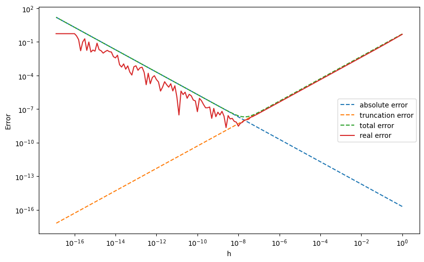

# 数值计算导论

###### 计11 周韧平 2021010699

**第一章上机题1: 编程实现例 1. 4 , 绘出图 1-2 , 体会两种误差对结果的不同影响**

本题要求可视化通过差商近似一阶导数的截断误差和舍入误差。 

截断误差为 $\frac{Mh}{2}$，舍入误差为 $\frac{2\epsilon}{h}$，和课本中一致，在双精度计算下（实际实现时使用的 `python` `numpy` 库的 `np.float64` 类型）实验中取 $M=1, \epsilon=10^{-16}$ , 绘图结果如下。

可以看到，大约在 $h = \sqrt{\epsilon/M} \approx10^{-8}$ 处，总误差达到最小，和上述分析一致，在 $h$ 较小时，舍入误差占主导，较大时截断误差占主导，这和对二者的理论表达式一致。

**第一章上机题3: 编程观察无穷级数的求和计算  **  

**（1）**

求解理论值时，我通过调和级数公式 $S_n = \sum^{n}_{i=1}{\frac{1}{i}} = ln(1+n)+C$ 来求调和级数求和的理论值，其中 $C \approx 0.57721566490153286060651209 $ 为欧拉常数。理论上当满足 $|\frac{1/(n+1)}{S_n}| \leq 0.5\epsilon_{mach}$ 时，出现“大数吃小数“现象，且由于 $a_n$ 单减 $S_n$ 单增，如果存在解 $n^*$ 满足，所有 $n>n^*$ 也满足，通过迭代方式求解得到 $min\{n^*\} = 2209628$​

求解实际值时，我用 `float32` 精度进行迭代求和，当在单精度下结果不变时，得到相应的 $n^*$，结果为 2097153，略小于理论计算值，这可能和调和级数求和（欧拉常数的估计）过程中的误差有关，同时由于 $|\frac{1/(n+1)}{S_n}| \leq 0.5\epsilon_{mach}$ 是发生大数吃小数的必要而非充分条件，因此理论求解的n较大也比较合理

**（2）**

通过 `float64` 类型迭代 2097153 次得到的结果与单精度计算结果的差值为 -0.2703755368251102，存在一定的误差，此时计算结果约为 15，相对误差约 2%

**（3）**

双精度采用之前的迭代方法迭代 $10^7$ 次用时 3.96s，迭代约 $522654040000001\times10^7$ 次后不再发生变化，估计结果为约需要 6.56 年计算