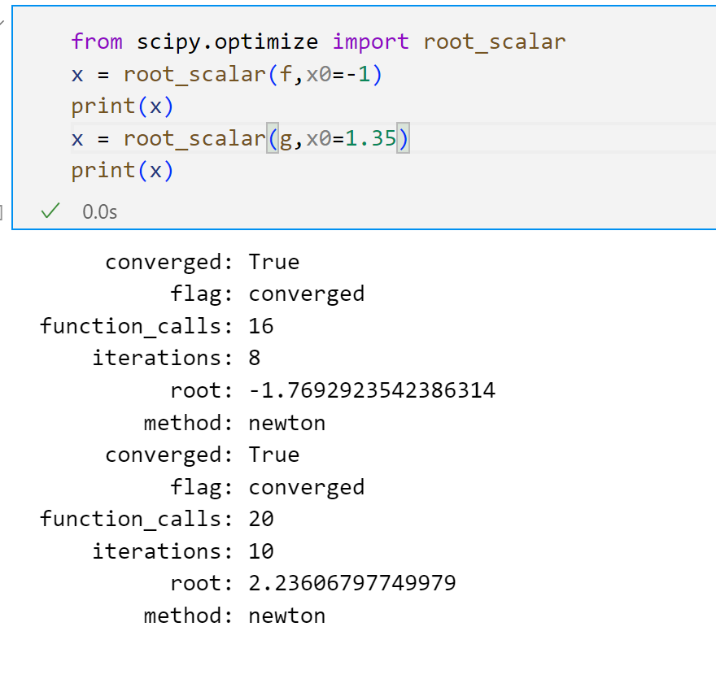
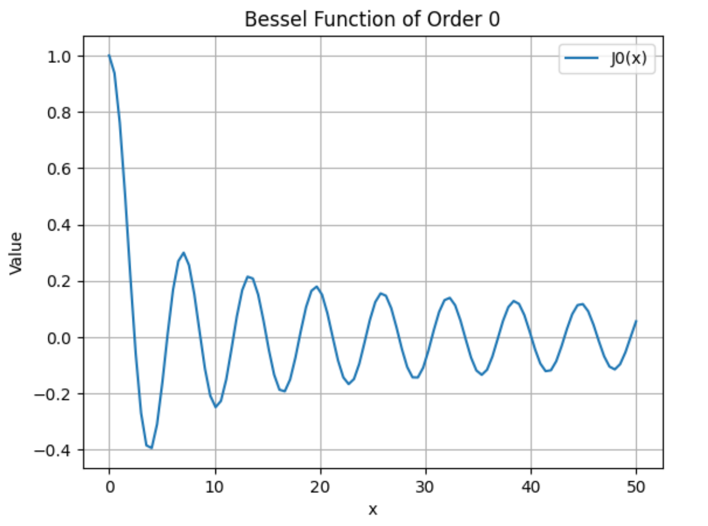

# 非线性方程求根

###### 计11 周韧平 2021010699

**编程实现牛顿法与牛顿下山法求解下面两个方程. 要求: (1) 设定合适的迭代判停准则; (2) 设置合适的下山因子序列; (3) 打印每个迭代步的近似解及下山因子; (4) 请用其他较准确的方法 (如MATLAB软件中的 fzero 函数) 验证牛顿法与牛顿下山法结果的正确性。最后，总结哪个问题需要用牛顿下山法求解，及采用它之后的效果**  

实现牛顿法时，依照课本中的算法，迭代公式为 $x_{t+1} = x_t-\frac{f(x_t)}{f'(x_t)}$，判停准则为 $|f(x)| \leq \epsilon$ 且 $\Delta x \leq  \epsilon$ 时，停止迭代，实现时我选取 $\epsilon = 10^{-6}$，其它算法实现细节与课本中的伪代码一致。为了避免不收敛，陷入死循环，我还设置了最大循环次数。

实现牛顿下山法时，我沿用了牛顿法中的判停准则，迭代公式为 $x_{t+1} = x_t-\lambda_i\frac{f(x_t)}{f'(x_t)}$，其中 $\lambda_i$ 为预定义的因子序列，实现时我选取为首项为$1-10^{-10}$，公差0.5 的等比数列，课本伪代码要求当函数值的绝对值小于前一步函数值绝对值时，将此时的 $\lambda_i$ 作为当前迭代步的下山因子，这部分我完全参考课本算法的实现。

对于第一个方程，牛顿下山法迭代过程如下，经过21次迭代最终停在 -1.76929235，迭代初期因子较小，后期逐渐变大，最后几步迭代都是第一个因子

而如果采用牛顿法求解会导致陷入 -1，1 的死循环，算法最终没有收敛

而对于第二个方程，两种算法都可以收敛到 2.23606

而通过调用 `scipy.optimize.root_scalar` 库可以得到两个方程的解为 -1.7692923542386314 和 2.23606797749979，我发现求解第一个方程时若采用 $x_0 = 0$ 也会导致无法收敛，我调整了合适的初值。该方法求解的值和牛顿（下山）法求解的接近

**利用 2. 6. 3 节给出的 fzerotx 程序，编程求第一类的零阶贝塞尔函数 的零点（ 在MATLAB 中可通过 besselj(0,x) 得到）. 试求 的前10个正的零点, 并绘出函数曲线和零点的位置**  

fzerotx 程序的实现完全参考课本，特别的，如果求解区间两端同号，函数返回 None，这是为了便于后面寻找区间内的解。

对于贝塞尔函数，我通过调用 `scipy.special.jn` 首先观察其形状，可以看到，前10个解大致在(0，50)的范围内，并且解之间的间隔不小于0.5

为了找到最小的10个正解，我以 $h=0.1$ 为步长，每次在区间 $ (low,high)$ 中使用 zeroin 算法寻找解，一开始 $low=0$， $high=h$，之后逐步增大high，每次增加 h，直到找到一个解x，这时，将low设为 $low = x+h$， $high = low+h$，继续迭代，直到找到前10个解，最终找到的解为  2.4035503109479257, 5.52355031094786, 8.646223210325896, 11.796223210325829, 14.936223210325762, 18.076223210326063, 21.216223210326554, 24.356223210327045, 27.496223210327535, 30.636223210328026。绘图如下，可以看到求出的解时较为准确的，基本和函数与x轴交点重合。

