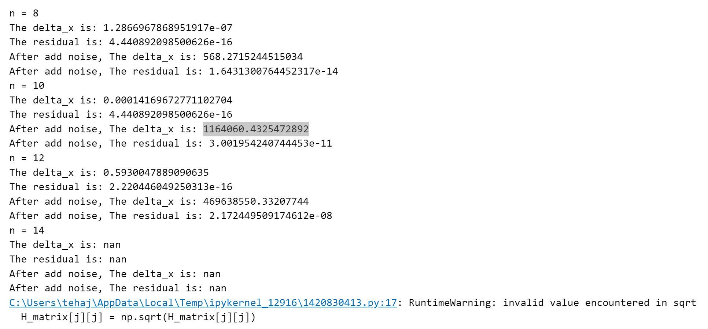
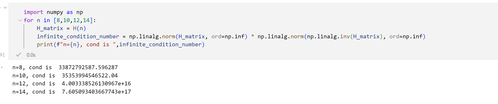

# 线性方程组的直接解法

按照书上伪代码我实现了Cholesky算法

```python
def Cholesky(H_matrix_,n):
    H_matrix = H_matrix_.copy() 
    for j in range(n):
        if j!=0:
            for k in range(j):
                H_matrix[j][j] -= H_matrix[j][k]**2
            H_matrix[j][j] = np.sqrt(H_matrix[j][j])
        for i in range(j+1,n):
            for k in range(j):
                H_matrix[i][j] -= H_matrix[i][k]*H_matrix[j][k]
            H_matrix[i][j] = H_matrix[i][j]/H_matrix[j][j]

    for i  in range(n):
        for j in range(i+1,n):
            H_matrix[i][j] = 0
    return H_matrix
```

分解后，我将方程 $Hx = b$ 求解转化为，$LL^Tx = b$  求解，也就是先求解 $Ly = b$ ，再求解 $L^Tx = y$，由于这些都是上三角和下三角矩阵，所以可以用课本中介绍的针对三角矩阵的求解方式求解。

```python
def solve_L(L,b,n):
    b_ = b.copy()
    for i in range(n):
        for j in range(i):
            b_[i] -= L[i][j]*b_[j]
        b_[i] = b_[i]/L[i][i]
        
    return b_

def solve_U(U,b,n):
    b_ = b.copy()
    for i in range(n-1,-1,-1):
        for j in range(i+1,n):
            b_[i] -= U[i][j]*b_[j]
        b_[i] = b_[i]/U[i][i]
        
    return b_
```

n = 10时， $||r||_{\infin}$ 和  $||\Delta x||_{\infin}$，分别为 4.440892098500626e-16 和 0.00014169672771102704

接下来，我对右端项引入了相对大小 $10^{-7}$ 的随机扰动，重新求解方程，发现残差的无穷范数为 3.001954240744453e-11，仍然较小，而解的无穷范数变为 1164060.4325472892。这说明 $Hx = b$ 是病态的。

接下来我尝试了n=8，12，14 ，结果如下



可以看到，n=8，10，12时，加入扰动后 x 的偏差都会显著增大，而且n越大这个偏差的绝对数值也会越大，但残差的误差一直比较小，这进一步说明了问题的病态性，而且这种病态性会随着n的增加而增加（H矩阵的条件数增加）



而n=14时，由于问题过于病态，导致了溢出现象，问题无法求解。