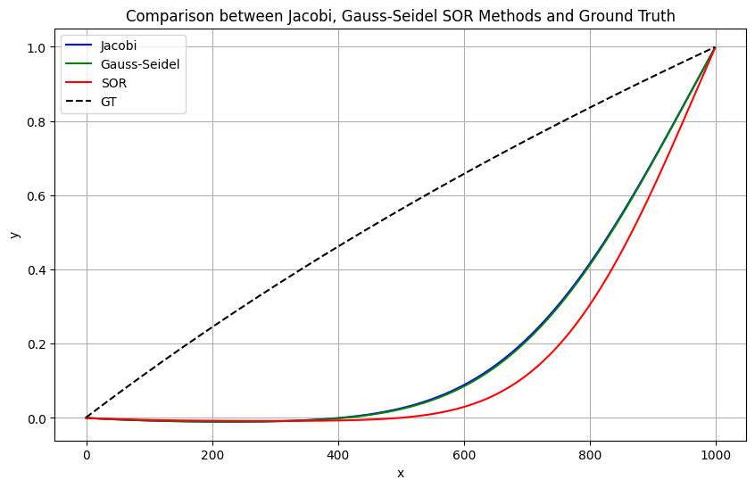
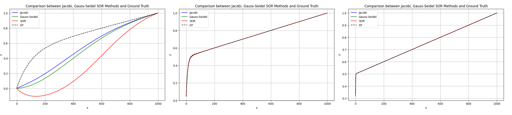
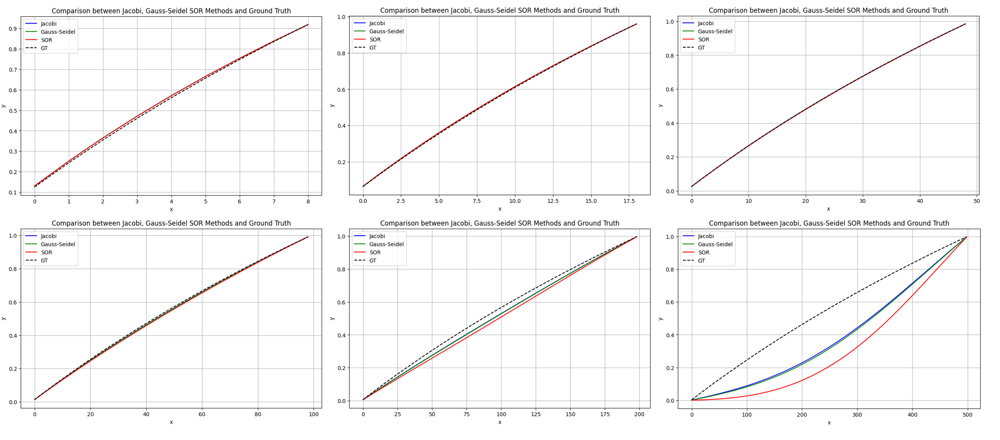

# 线性方程组的迭代解法

本题中我按照课本中的伪代码实现了三种迭代算法，由于A是稀疏矩阵，用 $n\times n$ 的矩阵来存储不仅浪费空间，在迭代时也包含大量不必要的零乘运算，因此我对矩阵做了压缩处理，考虑到只有主对角线和两条副对角线上有值，因此只需要用 $n\times 3$  的矩阵来存储原来方阵的信息即可。同时，在进行迭代的过程时，计算x的每一项时，也无需迭代整行，而是只计算这三个非零元和 b 的乘积即可。具体来说，对于 Jacobi 迭代法，原始迭代公式为 `x[i] = (b[i] - np.dot(A[i,:i], x_old[:i]) - np.dot(A[i,i+1:], x_old[i+1:])) / A[i,i]`， 实际上点乘中只有 i-1 项和 i+1 项是有用的，因此迭代过程等效为 

```python
ans = b[i]
if i>0:
    ans -= A[i,0]*x_old[i-1]
if i<n-1:
    ans -= A[i,2]*x_old[i+1]
x[i] = ans / A[i,1]
```

经过这一步的改进，矩阵存储的空间复杂度和算法单次迭代的时间复杂度从 $O(n^2)$ 变为 $O(n)$。

按照题目要求，我的判停准则设置为，当迭代前后的解相差的无穷范数小于 $10^{-5}$ 时，迭代终止。对于 SOR 方法，我选取松弛因子 $\omega = 0.8$

在第一问给定的参数条件下，我用三种方法求解了方程，Jacobi，G-S，SOR三种方法收敛步数为53247，26288， 26014。同时，我还将迭代求解的结果与标准结果 GT 做了比较，绘制折线图如下



可以看到，在 x = 0.5 附近，求解得到的结果和标准结果差距较大。

接下来，我探究了 $\epsilon$ 对问题求解的影响，下图从左到右分别为 $\epsilon=0.1, \epsilon=0.01, \epsilon=0.001$ 时迭代法求解结果和真实结果的对比



可以看到，随着 $\epsilon$ 的减小，解析解的线性性变差，但残差变小，数值解精度逐渐提高。此外，从迭代步数来看，$\epsilon=0.1$ 时迭代步数最多（Jacobi需要138415步），之后迭代步数逐渐变小，收敛速度变快。


此外，我还探究了变化 n 的值对解的准确度有何影响，下图分别为   $ n=10, n=20, n=50, n=100, n=200, n=500$ 时迭代法求解结果和真实结果的对比




可以看到，随着n的增加，解的精度逐渐变差，在 n=500 时，数值解和解析解存在较为明显的差异。同时，随着 n 的增加，收敛速度也随之变慢，$ n=10, n=20, n=50, n=100, n=200, n=500$​ 时 Jacobi 算法的收敛步数分别为 597,2838,8621,23532,55885


分析总结：

- $\epsilon$ 对于迭代法求解该问题存在较大的影响，$\epsilon$ 越小解越准确，$\epsilon<0.1$ 时$\epsilon$ 越小解收敛越快
- n对算法存在一定的影响，n的增加会大大降低收敛的速度，当 n 大于500时，求解误差较大
- 三种方法相比， G-S 迭代法具有更强的鲁棒性，收敛速度最快且求解结果在三种方法中较为精确。SOR表现最差，在大多数方法中求解的误差都是最大的，且收敛速度不具有明显优势，这和书中的结论相悖，分析可能和我没有搜索最佳的松弛因子有关。Jacobi 收敛速度最慢。在问题规模较大时，三种方法收敛速度都比较慢。