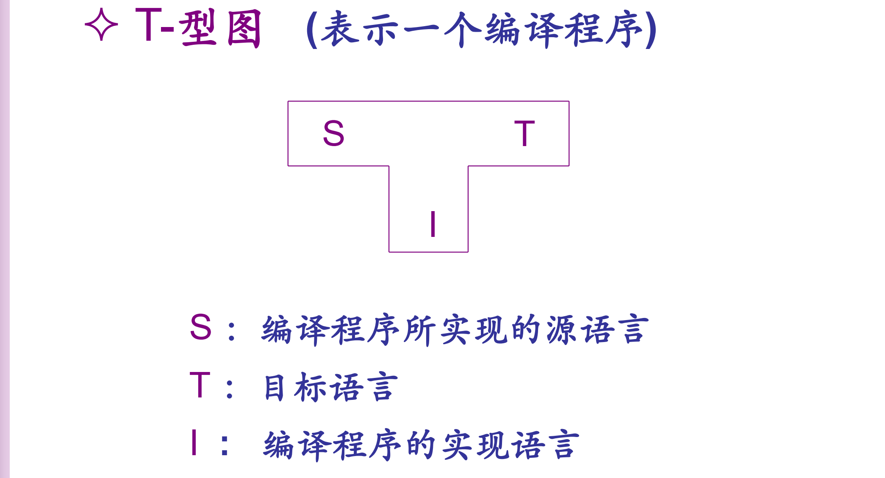
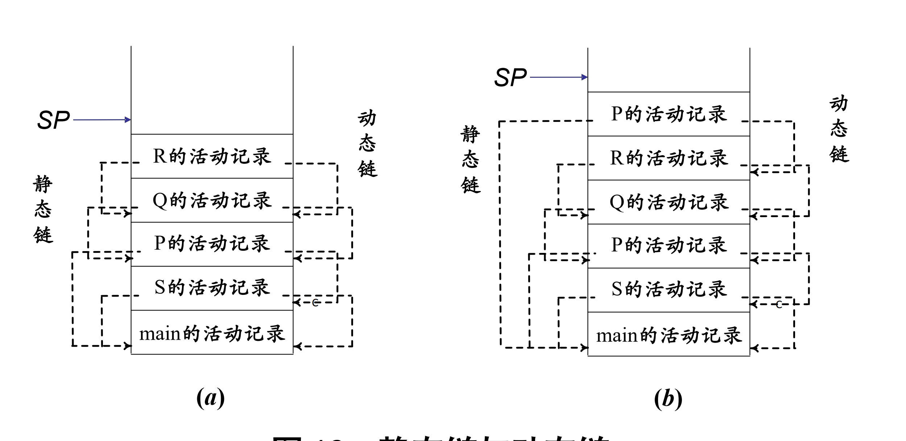

# 编原算法整理

> 开辟鸿蒙，女娲补天 qaq

> 背背背，背背背

## T型图

## 自顶向下语法分析

### LL(1)分析

概念：**Left**（从左到右扫描输入串）**Leftmost**（非终结符最左推导）**1**（向前查看一个单词）

tips：考试的时候可以将得到的结果和观察校验

### 三类集合的计算

#### First

**定义：**一个句型 $\alpha$ 若可以推导出另一个以终结符 $a$ 开头的句型，那么 $a$ 属于First（$\alpha$）；若 $\alpha$ 可以推导出 $\varepsilon$，那么 $\varepsilon$ 属于 First（$\alpha$）

**讲义方法：**迭代求解

**民间方法：**观察A产生式右端的首个单词B，如果B是终结符，那么就这条产生式而言 First(A) 集合里只有B这一个单词。如果B是非终结符，且B不能推出空集合(或者说 First(B) 里没有空字符串)，那么但就这条产生式而言 $First(A) = First(B)$，进一步如果B能推出空字符串，则还需要继续看下一个字符。

特别的，对终结符（包括 $\varepsilon$）来说，$First(a) = \{a\}$

关键是要看 $\varepsilon$ 是否存在 

#### Follow

若 G 中存在一个包含子串 Xa 的句型，那么 a 属于 Follow(X)；G 中存在一个以 X 结尾的句型，那么 **#** 属于 Follow(X)

**讲义方法：**还是迭代

**民间方法：**对于 $Follow(A)$，观察右端包含A的产生式$B->..ACD..$，首先把C的 $Fisrt(C)$ 给 $Follow(A)$，然后如果据C能产生 $\varepsilon$ ，再去看D……如果最后找到了末尾，则需要把 $Follow(B)$ 给 $Follow(A)$

特别的，一开始有 $Follow(S) = \{\#\}$

Follow集合不包含 $\varepsilon$ ，这样没意义

#### PS（Predictive Set）

对于 $A \rarr \alpha$

如果 $\varepsilon \notin First(\alpha)$，则有 $PS(A \rarr \alpha) = First(\alpha)$

否则 $PS(A \rarr \alpha) = (First(\alpha) - \{\epsilon\}) \cup Follow(A)$

直观理解就是作用这条产生式时需要要看到下一个单词是什么，这个单词可能来自于这个串生成的字符串($First(\alpha)$)，也可能来自于 $Follow(A)$

**LL(1) 的判定：**文法G是LL(1)的，当且仅当对于 G 中任何两个有相同左部的不同产生式  $A\rarr\alpha,A\rarr \beta$，有$PS(A\rarr\alpha) \cap PS(A\rarr \beta) = \Phi$，直观理解就是只看一个字符就能确定调用哪个产生式

### 递归下降分析程序

常见的递归下降分析程序的形式可以参考下面这个例子

- void Parse\<S\>，S为产生符
- case \<set\>，\<set\> 表示某一条产生式的PS集合
- 每个case里面根据产生式右端内容写对应的Parse和MatchToken，最后加break
- default里面加报错

### 表驱动分析程序

根据PS可以构造一个**预测分析表**，再构造一个**下推栈**，初始只包含 #，首先将开始符号 S 推入栈，然后执行下列步骤：

1. 若栈顶为**终结符**，则判断当前读入的单词符号是否与该终结符相匹配，若匹配，再读取下一单词符号继续分析； 若不匹配，则进行错误处理。  
2. 若栈顶为**非终结符**， 则根据该终结符和当前输入单词符号查 LL（1）分析表，若相应表项中是产生式（唯一的），则将此非终结符出栈，并把产生式**右部符号从右至左入栈**；若表项为空，则进行错误处理。  
3. 重复（1）和（2），直到栈顶为 # 同时输入也遇到结束符 # 时，分析结束  

这里主要是要注意产生式右部符号的入栈次序

### 文法变换

#### 消除左递归

左递归分为直接左递归（$A\rarr Ab$）和间接左递归（$A\rarr Bb,B\rarr A c$）

包含左递归或左公因子的文法一般不是LL(1) 的

**消除直接左递归：**

**消除间接左递归：**

总结：首先确定某种顺序，然后把原有的文法写开，保证某个产生式后面每个生成式的首单词，顺序小于等于这个产生符，如果小于则没事儿，如果等于则用之前消除直接子递归的公式拆开

## 自底向上语法分析：LR 分析

概念：**Left**（从左到右扫描输入串）**Rightmost **（非终结符最右推导）

### 基本概念

- 句子：将开始符号 S 能推导出来的一个**终结符串**称为一个句子  
- 句型：将开始符号 S 能推导出来的一个**串**称为一个句型  
- 右句型：将开始符号 S 能**最右推导**出来的一个**串**称为一个右句型  
- 短语：若 $S\rarr^*\alpha A \delta$ 且 $A\rarr^+\beta$，则称 $\beta$ 是句型 $\alpha \beta \delta$ 的一个短语，现实中可以通过语法分析树判断，只要字串等于某个节点开始完全推出来的字符串，那么就可以称为一个对应的短语，**不要忘记空串**
- 直接短语：上述  $A\rarr\beta$ 是一步得到的，体现在语法分析树就是 $\beta$ 是某个节点的**直接子孙**
- 句柄：一个右句型 $\alpha A \omega'$ （这里 $\omega'$ 一定是终结符构成的串）中A能一步推导出 $\beta$ ，则称 $\beta$ 是 $\alpha \beta \omega'$ 相对于 A 的句柄，句柄一定是直接短语，可以理解为分析树中最靠左的直接短语，另一种理解是句柄是当前句型从左到右最先出现的“一步可归约串”  
  - 一般情况下，如果所考虑的文法是**无二义的**，那么每个右句型有唯一的最右推导，也对应有唯一的以根结点为开始符号的分析树，因而其**句柄是唯一的**。  

### 移进-规约分析

下推栈 + 状态控制引擎（有限状态自动机）

- Reduce：对栈顶短语规约  
- Shift：将输入序列移进一个单词  

增广文法和活前缀：TODO

#### LR分析表

 **ACTION表**：告诉分析引擎，栈顶状态为k, 当前输入单词符号是 a 时应该完成的动作。

$ACTION [k,a] = s_i$ Shift：状态 i 移进栈顶

$ACTION [k,a] = r_j$， Reduce：按第 j 条产生式归约

$ACTION [k,a] = acc$， Accept：分析完成

$ACTION [k,a] = err$，Error：发现错误 （常标为空白）

**GOTO表**：$GOTO[i,A] = j$ ，告诉分析引擎，在依产生式 A->β归约之后，位于栈顶的状态如何改变。依产生式 $A\rarr\beta$ 归约时，要将栈顶的 $|\beta|$ 个状态弹出，假设此时位于栈顶的状态是 i，那么就将新状态为 j 移进栈顶。

#### LR(0) 

Left（从左到右）Rightmost（最右推导）0（向前查看0符号）  

**LR(0) FSM的构造**

- 移进项目: 形如$A\rarr\alpha.a\beta$，表示期望移进 a 以继续
- 待约项目: 形如$A\rarr\alpha.B\beta$, 表示希望能够规约出 B 以继续
- 归约项目: 形如$A\rarr\alpha$., 表示可以进行规约，**需要特别注意 $S'\rarr S.$ 不是归约项目**，这在后面判断冲突时很重要
- 接受项目: 形如$S'\rarr S.$, 表示开始符号能够规约了，完成分析

**闭包（CLOSURE）**：对于一个项目集 I，将其中每一个项目产生式右边的 .紧邻的非终结符代入其所有产生式（项目），可以得到若干新的项目，将它们迭代放入 CLOSURE(I) 中。  **一个闭包就是一个状态，初始状态为$CLOSURE({S'\rarr .S})$**

**冲突：**

- 移进-规约冲突：任何一个状态中不会同时有移进项目和规约项目  
- 规约-规约冲突：任何一个状态中不会有多个规约项目  

如果没有这两种冲突，则可以判定是LR（0）文法

#### SLR(1)

Simple（简单）Left（从左到右）Rightmost（最右推导）1（向前查看1符号）  

和 LR(0) 的区别在于对规约进行了约束，只有当前输入符号在规约结果的 Follow 集中才规约，同理也修改了冲突的定义：

- 无移进-规约冲突：任何一个状态中如果有移进项目期待移进终结符x，则x不在该状态任何一个规约结果的 Follow 集中
- 无规约-规约冲突：任何一个状态中的任何两个规约项目的规约结果的 Follow 集无交集  

SLR（1）比LR（0）报错更早，因为LR（0）是无论下一个符号是什么都要规约，而SLR（1）只规约那些在Follow集合内的，体现在LR分析表中，LR（0）的Action表中，$r_i$ 总是整行出现，而SLR（1）中同一行既有移进表项又有规约表项

#### LR(1)

Left（从左到右）Rightmost（最右推导）1（向前查看1符号）

SLR（ 1） 分析方法也有一定的局限性： 只考虑到所归约非终结符的 Follow 符号。但一个输入符号属于所归约非终结符的 Follow 集合，未必就是句柄可以后跟的符号。  

从LR（0）到LR（1）需要引入**前向搜索符**，对于初始状态有 $I_0 = CLOSURE({[S'\rarr .S, \#]})$，构造闭包时，对于形如 $[A \rarr \alpha .B \beta, a]$ 的项目和文法产生式 $B\rarr \gamma$，将所有 $[B \rarr .\gamma, b]$ 的项目加入闭包，其中 $b\in First(\beta a)$ （可以形象理解为在给定一个项目的情况下，B后面可能出现的前向搜索符，这个符号应该是 $Follow(B)$ 的子集）

冲突定义：把SLR(1)中的Follow集合替换成了前向搜索符集合

- 无移进-规约冲突：任何一个状态中如果有移进项目期待移进终结符x，则x不在该状态任何一个规约项目的向前搜索符中
- 无规约-规约冲突：任何一个状态中任何两个规约项目的向前搜索符不相交  

#### LALR(1)

LookAhead（向前搜索）Left（从左到右）Rightmost（最右推导）1（向前查看1符号）  

芯：将 LR(1) 项目的向前搜索符去掉的结果（即为对应的 LR(0) 项目）称为它的芯  

同芯状态：LR(1) FSM 的两个状态如果只考虑芯发现它们完全一样，那么它们是同芯状态  

LALR（1）就是合并了所有同芯状态的结果（保留前向搜索符号），如果合并后不产生新的规约-规约冲突（不会出现移进-规约冲突，因为合并的状态一定是同芯且自身不存在冲突的），则原文法是LALR(1)文法。

### 几种文法的关系

## 符号表

### 作用域

- 作用域之间可以嵌套，不会交错
- 对于程序的某一特殊点而言，该点所在的作用域称为当前作用域
- 当前作用域与包含它的程序单元所构成的作用域称为**开作用域**
- 不属于开作用域的作用域称为闭作用域

### 可见性规则

- 在程序的任何一点，只有在该点的开作用域中声明的名字才是可访问的
- 若一个名字在多个开作用域中被声明，则把离该名字的某个引用最近的声明作为该引用的解释
- 新的声明只能出现在当前作用域  

## 基于属性文法的语义计算

我们在文法 G[S] 基础上，为文法符号关联有特定意义的**属性**，并为产生式关联相应的**语义动作**或**条件谓词**，称之为属性文法，并称文法 G[S] 是这一属性文法的**基础文法**  

### 基本概念

对关联于产生式$A\rarr\alpha$的语义动作 $b := f(c1, c2,…, ck)$，如果 b 是 A 的某个属性, 则称 b 是 A 的**综合属性**。计算综合属性是对父结点的属性赋值，“自底向上”传递信息。

对关联于产生式$A\rarr\alpha$的语义动作 $b := f(c1, c2,…, ck)$，如果 b 是产生式右部某文法符号X 的某属性, 则称 b 是X 的**继承属性**。计算它是对子结点的属性赋值，“自顶向下”传递信息。

**复写规则**：形如 X.a := Y.b 的语义动作称为**复写规则。**

### 属性文法

- **S-属性文法**：只包含综合属性  
- **L-属性文法**：产生式右边的符号的继承属性只来自于父亲的继承属性与长兄的属性  

S-属性文法可以自下而上计算，采用 LR 分析即可，综合属性的计算恰好在LR 分析规约时，因此将前文 LR 分析中的栈在状态栈、符号栈的基础上再加一个语义栈用于记录综合属性（注：一般只涉及一个综合属性，如果有多个可以有多个语义栈），掌握 LR 分析后加个语义计算不难  

L-属性文法可以考虑自上而下（递归下降）计算，采用多叉树的后根遍历顺序，在从左到右访问完所有孩子后，再计算父亲的综合属性，访问孩子时计算其继承属性，由于L-属性文法继承属性一定来自父亲和长兄，因此这个朴素的算法正确性没有问题。这个过程本身的复杂度在于构造出语法生成树，可能需要用到 LL(1) 分析。  

### 翻译模式

翻译模式在形式上类似于属性文法，**但允许由{}括起来的语义动作出现在产生式右端的任何位置**，以此显式地表达属性计算的次序。

S-翻译模式：仅涉及综合属性，通常将语义动作集合置于相应产生式右端的末尾。

L-翻译模式：包含综合属性和继承属性，需满足：

（1）产生式右端某个符号继承属性的计算必须位于该符号之前，其语义动作不访问位于它右边符号的属性，只依赖于该符号左边符号的（继承）属性；

（2）产生式左部非终结符的综合属性的计算只能在所用到的属性都已计算出来后进行，通常将相应的语义动作置于产生式的尾部。

#### 基于L-翻译模式自顶向下的语义计算

在 LL(1) 分析的代码的基础上补充属性部分，考虑左递归的消除，左递归消除时得连带着语义规则进行改变，例如

    

#### 基于S-翻译模式自底向上的语义计算

- 去掉嵌套在中间的语义动作（即中间只有赋值没有操作，末尾的操作可以在规约时完成，中间不好处理触发时机）
- 在分析栈中考虑继承属性的读写（不再是简单地和符号栈、状态栈保持一致）
- 用综合属性替代继承属性

#### 基于L-翻译模式的自底向上语义计算

先解决继承属性的普通函数求值问题，再解决其访问一致性，我们的目标是：通过变换翻译模式（如增加新的文法符号，增加相应的复写规则和产生式），使嵌在产生式中间的语义动作集中仅含复写规则，并使得在自底向上的语法分析过程中，文法符号的所有继承属性均可以通过归约前已出现在分析栈中的综合属性唯一确定地进行访问。

需要注意的是：不可以改变L-翻译模式的特性。若不是L-翻译模式，则不能保证归约前需要访问的综合属性已出现在分析栈中。

> hw3,4 都是翻译模式这部分内容，感觉可以考得很活qaq

## 静态语义分析与中间代码生成

### 语义分析

主要是类型检查和语法检查

- 表达式要类型匹配
- 需要布尔逻辑时类型确实是 bool
- 每条语句都 ok 了才是 ok
- 常量表达式的类型是自己，标识符的类型查符号表
- 有 break 时需要注意在循环里才能 break （所以加了个 break 继承属性标志是否在循环里）

### 中间代码生成

> 改编自饶老师笔记

1. 赋值与计算：这部分用 S 翻译模式即可，生成代码时用连接符号||把各个部分的代码先摆出来（理论上先后顺序可以调）然后再用 gen 生成它们之间的计算语句；需要注意计算结果一般是右值，需要用newtemp 新建一个临时变量保存结构（但是小括号和标识符作为左值直接传递）

2. 说明语句：这里需要完成符号表，因此要弄清楚每个变量的类型、偏移，以及为了算偏移而增加的继承属性宽度

3. 数组说明：数组说明略微复杂一点，而且课上例子给的是非常反人类的（常用语言数组范围都是 [0, n) 或 [1, n]，我还没见过 [l, u) 的），似乎也没考过

4. 布尔表达式：如果直接用 1 和 0 完成布尔表达式计算则和赋值与计算差别不大，只需要主要逻辑表达式（id1 rop id2）需要用到 if id1rop.op id2 goto 的分支来处理结果是 1 还是 0，另外nextstat 表示下一条 TAC 语句的位置，但由于在 gen 中用到它时，gen 的这条语句还没生成出来，所以此时 nextstat 就是指的要 gen 的这个语句

5. **布尔短路表达式**：有两种翻译方法——直接对布尔表达式求值和通过控制流体现布尔表达式的语义  

   1. 直接求值很简单，用 `.place` 代表存入布尔值的符号，生成代码的时候翻译一下布尔表达式就行
   2. 如果要考虑到布尔表达式的短路运算，则要用到 L翻译模式处处考虑 true 标签和 false 标签，可以看看讲义里的图来辅助理解。下面的几种语句应该是基于这种模式设计的（否则布尔表达式里都没有跳转到 true 和 false）

   

6. 条件语句：if E then S 和 if E then S else S，参考讲义图片理解即可，**别忘了在 else 之间加上 goto 到 S.next**

   

   

7. 循环语句：while E then S语句，同样参考讲义图片理解，**别忘了在 S之后加上 goto 到 S.next (E 之前)**

   

8. 顺序语句：即 S; S 语句，记得在中间打上 S1.next 标签即可（一但一个标签被赋予了newlabel，则在该文法生成的中间代码内就必须显示的指明这个label的位置）

9. break语句：由于 break 的合法性已经在语义检查完成了，因此这里默认 break 是可行的，使用继承属性 break 传递了 break 的目标地址

## 运行时存储组织

### 嵌套过程活动记录  

#### 静态链和动态链

**静态链：**在所有活动记录都增加一个域，指向当前过程的直接外过程运行时的最新活动记录  

**动态链：**指向该调用过程的活动记录（的基址）  

#### Display表

Display 表记录各嵌套层当前过程的活动记录在运行栈上的起始位置（基地址）。若当前激活的过程的层次为 k（最外的层次设为 0），则对应的 Display 表含有 k+1 个单元

**Display 表的维护**  

在每个活动记录中保存一个Display表（x）——太多冗余

存储一个全局Display表，再在每一个活动记录里存全局表对应项先前的值，可以理解为全局链表存了一堆链表表头的指针，然后局部活动记录存的是指向下一个节点的指针，'_'表示是尾部

需要注意的是当嵌套层减少的时候Display表不会自己删除原有的值，所以即使是一个很浅的嵌套调用，其全局Display表依然会因为历史原因存了比较多的值

## 流图  

### 基本概念

- **基本块（Basic Block）：**程序中一个顺序执行的语句序列，其中只有一个入口语句和一个出口语句。执行时只能从其入口语句进入，从其出口语句退出
  - 基本块的入口语句可以是下面任意三类语句：（1）程序的第1条语句；或者，（2）条件跳转语句或无条件跳转语句的跳转目标语句；或者，（3）条件跳转语句后面的相邻语句
  - 划分基本块的方法：
    1. 先求出各个基本块的入口语句；
    2. 对每一入口语句，构造其所属的基本块。它是由该语句到下一入口语句（不包括下一入口语句），或者到某个跳转语句（包括该跳转语句），或者到某个停语句（包括该停语句）之间的语句序列组成的。
- **支配结点**：如果从流图出发点到 n 必须经过 m，则 m 是 n 的支配结点（n 被 m 支配了），记作 m DOM n，**特别的约定 n DOM n 恒成立**
- **支配结点集**：n 的所有支配结点的集合（由定义知至少有 n，所以非空），虽然流图是个有环图，不过从树的角度考虑可以认为里面的都是 n 的长辈
- **回边**：如果 d 在 n 的支配结点集里（d 是 n 的长辈），但是存在一条有向边 n -> d（n 以下犯上），则称这条边为回边  
- **自然循环**：若 n->d 是回边，则存在自然循环，简称循环，该循环是由**结点 d、结点 n 以及有通路到达 n 而该通路不经过 d 的所有结点组成**，并且 d 是该循环的惟一入口结点。特别的，如果存在边 n->n，那么它对应的自然循环为 {n}  

### 到达-定值数据流

对变量 A 的定值（definition）是指一条（TAC）语句赋值**或可能赋值**给 A

变量 A 的定值点 d 到达某点 p，是指流图中从 d 有一条路径到达 p 且该通路上没有 A 的其它定值。

到达-定值数据流分析就是**分析每一个点p中各个变量所对应的定值点**，单位是语句

方程如下：
$$
IN[B] = \cup_{b\in P[B]}OUT[b] \\
OUT[B] = GEN[B] \cup (IN[B]-KILL[B])
$$

- $P[B]$ ：表示B的所有前驱节点
- $GEN[B]$：B中能产生的新的定值语句，且该语句能活到出口（或者说是B中最后一条定值语句）
- $KILL[B]$：能到达 B 的且会被 B 中的定值语句重新覆盖的语句 ==如果B有到自己的自环的话，不能把B中可能被KILL的语句囊括在这个集合中（这里助教也有点模糊）==
- $IN[B]$ ：所有能到 B 入口处的定值语句
- $OUT[B]$：所有能到 B 出口处的定值语句

用迭代法计算每个基本块的 IN，OUT 集合，算法如下

1. 初始化：计算出各个块 GEN 和 KILL 集合 ，并让所有基本块 $IN[B] = \Phi ,OUT[B] = GEN[B]$
2. 对 $B_1,B_2,\cdots,B_n$ 逐一用数据流方程更新其 IN 和 OUT 集合
3. 重复过程知道不再更新

tips：手算时不需要严格按照顺序迭代，技巧在于只要有一个基本块的 OUT 集发生变化，就更新所有他级联孩子的 IN 集合，一开始从根开始算 OUT，应该可以减少迭代步数

### 活跃变量数据流

对程序中的某变量 A 和某点 p 而言，如果存在一条从 p 开始的通路，其中引用了 A 在点 p 的值，则称 A 在点p 是活跃的。否则称 A 在点 p 是死亡的

活跃变量数据流分析的就是在**某一基本块出口处还有用的变量**，因为有没有用是考后面的基本快决定的，所以数据流需要从后向前计算

方程如下
$$
LiveOut[B] = \cup_{s\in S[B]}LiveIn[s] \\
LiveIn[B] = LiveUse[B] \cup (LiveOut[B]-Def[B])
$$

- $LiveUse[B]$：表示B中被引用了的值，且**在引用之前还没有被B中定值过**（保证引用的真的是其祖先节点的定值）
- $Def[B]$：B中定值且定制之前没有被引用过（确保和 $LiveUse[B]$ 交集为空，且并集为B中所有变量）
- $LiveIn[B]$：入口处的活跃变量
- $LiveOut[B]$：出口处的活跃变量

迭代过程：

1. 初始化：计算出各个块 LiveUse 和 Def 集合 ，所有基本块 $LiveOut[B] = \Phi ,LiveIn[B] = LiveUse[B]$
2. 对 $B_1,B_2,\cdots,B_n$ 逐一用数据流方程更新其 LiveOut和 LiveIn 集合
3. 重复 2 直到集合不再变化

tips：和到达-定值流分析相似，这次就从后向前迭代，只要孩子的 LiveIn 一变，立马更新对应的父亲，初始化和到达-定值数据流刚好相反，记忆办法就是，每次都是把等式左边的初始化成第一项的已知量（GEN和LiveUse，等式左边暂时还不知道，就都赋成空集）

### UD链

定义：假设在程序中某点u引用了变量A的值，则把能到达u的A的所有定值点的全体，称为A在引用点u的引用-定值链（Use-Definition Chaining），简称 UD 链

确定UD链可以通过到达-定值数据流，分两种情况讨论

（1）如果在基本块B中，变量A的引用点u之前有A的定值点d，并且A在点d的定值可以到达u，那么A在点u的UD链就是 $\{d\}$。

（2）如果在基本块中，变量A的引用点u之前没有A的定值点，那么，**in[B] 中 A 的所有定值点**均到达u，它们就是A在点u的UD链。

### DU链

定义：假设在程序中某点 p 定义了变量 A 的值，从 p 存在一条到达 A 的某个引用点 s 的路径，且该路径上不存在 A 的其他定值点，则把所有此类引用点 s 的全体称为 A 在定值点 p 的定值－引 用链（Definition-Use Chaining），简称 DU 链。

确定DU链也可以分为两种情况讨论：

（1）如果 B 中 p 后面没有 A 的其它定值点，则 B 中 p 后 面 A 的所有引用点加上 LiveOut[B]中 A 的所有引用点，就是 A 在定值点 p 的 DU 链；
（2）如果 B 中 p 后面有 A 的其它定值点，则**从 p 到与 p 距离最近的那个 A 的定值点之间**的 A 的所有引用点， 就是 A 在定值点 p 的 DU 链。

这里计算的时候需要对活跃变量数据流做一点改动，但课上没有介绍详细的方法，估计考试的时候通过观察法得到，就是沿着定值点往后看孩子里有没有被重新定义即可

### DAG 图

### 寄存器数量优化  

**Ershov 数**：表示表达式中计算对应节点的结果至少需要多少个寄存器，算法如下

1. 叶节点为标为1
2. 自下而上标记，如果孩子相等则+1，否则取较大的那个

**寄存器相干图着色问题：**  

- **构造寄存器相干图：**一个结点在该点被定值，而另一个结点在紧靠该定值之后的点是活跃的，则在这两个结点间连一条边。  
- **对相干图进行着色（coloring）**，是指使用 k（对应物理寄存器的数量）种颜色对相干图进行着色，使得任何相邻的结点均具有不同的颜色（即两个相干的伪寄存器不会分配到同一个物理寄存器）。这样，我们就把物理寄存器指派的问题转化成了图论问题。  

**TAC语句优化**：常量合并，删除公共子表达式，删除无用赋值。总得来说就是把图画出来，按照需求删无用边和节点，最终起到优化代码的作用

