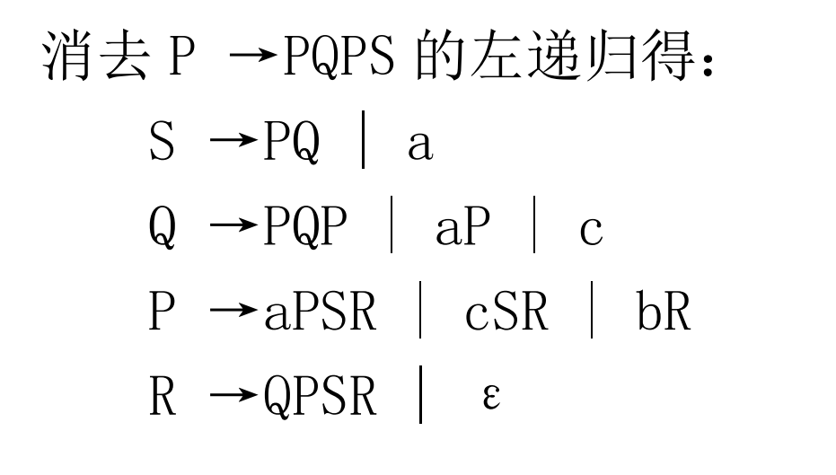
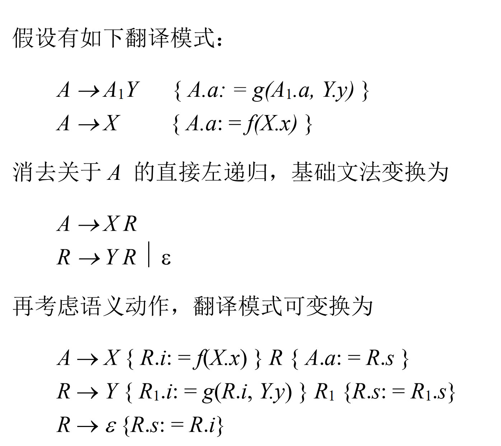
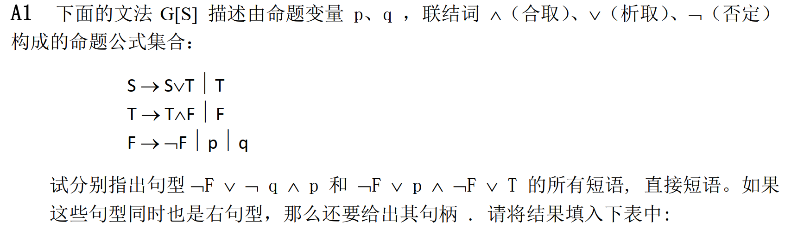
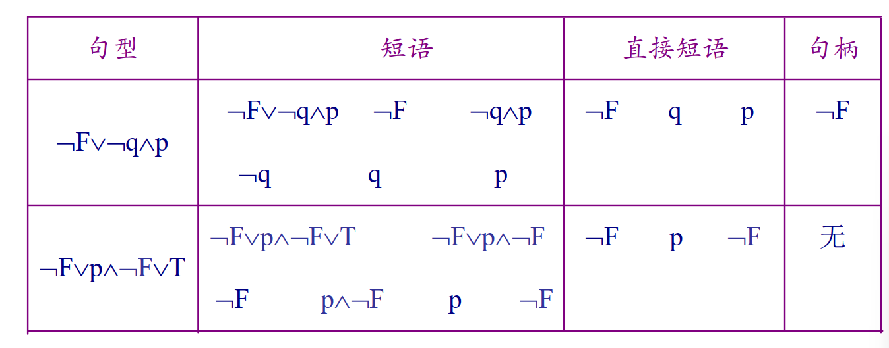
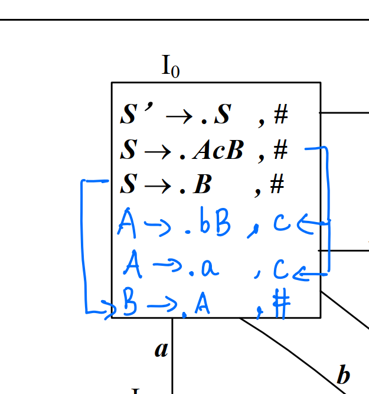

# 易错点整理

## 左递归消除

最后一个产生式，不要忘记==$\varepsilon$==

==继承模式变换规则==

## 自底向上分析

==只有右句型才有句柄==，判断一个直接短语是不是句柄前，首先要判断该句型是不是右句型

## 四种移进-规约分析

==需要注意求闭包的时候有可能要多次迭代==，比如下面这个例子最后一行的点后面有A，需要再迭代一次给第四行第五行的向前搜索符中加#

## DU链和UD链

==不包含自身==