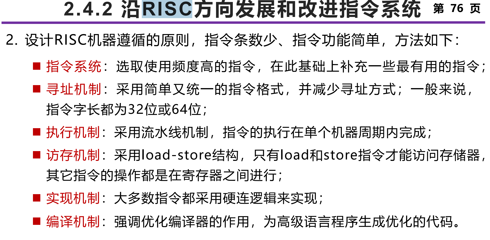
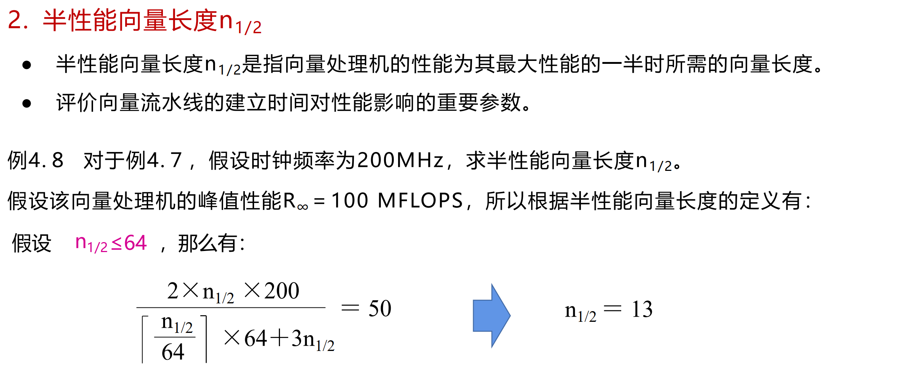

# 计系构面向往年题

###### 过拟合，给我狠狠过拟合 qaq

## 选择题

1. **程序的顺序执行，是造成时间局部性原因之一**

答案：错，是空间局部性的原因

2. **组相联映射是对全相联和直接映射的一种折中，组间采用全相联映射，组内采用直接映像**  

答案：错，全相联是可以放在任意位置，直接映射是位置唯一确定，组相联应该是组内全相联，组件直接映射

3. **采用多种寻址方式可以减少程序的指令条数，但可能增加处理器实现的复杂度以及指令的CPI**  

4. **流水线属于时间重叠 / 并行技术**  

对

5. **数据总线宽度对于高级程序员来说是透明的**  

对

6. **某型号处理器增加几条媒体处理指令后，不会影响其软件的向后兼容性**

对，向后兼容就是只能增加不能删改。

7. **在顺序发射、顺序完成的指令单流水线中，不存在WAW（写后写）和WAR（读后写）冲突**  

对。WAW冲突存在要求指令被重新排序或者有多个写的段，WAR冲突要求指令被重新排序或者读操作滞后

8. **在指令字长确定的情况下，指令系统设计需综合考虑寄存器个数、寻址方式、立即数长度等需求**

   对

9. **动态多功能流水线通过不同连接方式允许在同一时刻执行不同功能**  

10. **减小 CPI 是 RISC架构的精华，而只有 Load 和 Store 指令可以访存则是RISC架构的根本**

    错。“根本”的描述是错的

11. **从系统结构角度看，增加流水线级数可以提高处理器频率**

  对

12. **增加Cache组相联度将会减少Cache的冲突缺失次数，但会增加命中时间**  

对，发展到最后就是全相联了

13. **多级层次存储系统一定要满足包含关系，即上层缓存中的数据一定可以在其下级存储器中找到**  

对（？）

14. **采用写回（write-back）的Cache，当发生读缺失时，有时会引起写主存操作**  

对。写通过（写直达）一般搭配写不分配方法，核心就是优先写主存，只有当命中时修改cache内的内容；写回一般搭配写分配方法，核心是优先写cache，如果命中的话只改cache，不命中的话不仅要改主存，还要修改读入对应的cache

15. **DRAM的密度比SRAM的密度大** 

对。SRAM基于硬件设计（触发器），高速，低密度，小容量，DRAM基于电容设计，低速，低成本，高密度，大容量，需要周期刷新

16. **在Cache-主存存储层次中，Cache块越大，则强制缺失次数 （compulsory miss）越少**

  对

17. **为了支持精确中断，Tomasulo 算法需要ROB（Reorder Buffer）支持**  

对

18. **平均每条指令的执行周期数与程序无关**

错

19. **Victim Cache是位于CPU和Cache间的又一级 Cache** 

错，在Cache和下一级存储器的通路之间

20. **通过寄存器重命名，可以消除WAW和WAR相关**  

对。寄存器重命名可以消除WAW和WAR相关。

21. **关键字优先或早启动（early restart）技术可减少Cache缺失率：**

错，这两个降低的是Cache缺失的损失（或称代价）

22. **较小而简单的Cache有利于减少命中时间，但会提高缺失率**  

对。

23. **INTEL安腾处理器采用的是VLIW架构**  

错

24. **采用写通过（write-through）策略，需要使用写缓冲器（write buffer）来提高性能，而采用写回策略的Cache则没有必要使用写缓冲器**

错，都有必要

25. **乱序执行的处理器采用多路组相联Cache时，为了减少功耗， ⼀般采用Tag比较和数据访问串行的方式，并通过指令乱序执行来弥补由于存储访问延迟造成的性能下降问题**

对

26. **伪相联（Pseudo-Associativity）Cache由于变化的命中时间对CPU流水线影响较大，⼀般适合离CPU远的Cache**

27. **向量指令间存在针对同一向量寄存器的RAR（read after read）冲突。**  

对（？）

28. **半性能向量长度n1/2等于向量寄存器长度的1/2**

错，是向量处理机的性能为其最大性能的⼀半时所需的向量长度

29. **通过编译将循环展开成4个循环体时， ⼀般可减少6条指令（测试和分支）**  

30. **循环展开通过寄存器重命名和指令调度可有效开发指令级并行**

对  

## 单选题

31. 

32. 

33. 

34. 

35. 

36. 

37. 

38. 

39. 

40. 

41. 

应该就是说后续指令做什么不算在分支指令的性能里

42. 

43. 

44. 

45. 

46. 

47. ？

48. 

49. 

50. ？

51. 

52. 

53. 

54. 

3 的 2b+c是因为写回在修改cache中页面的时候不会修改主存，因此替换的时候还要写回主存，如果是写直达就是b+c