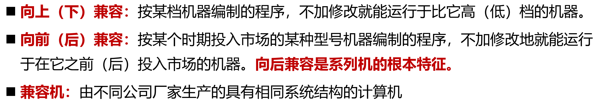
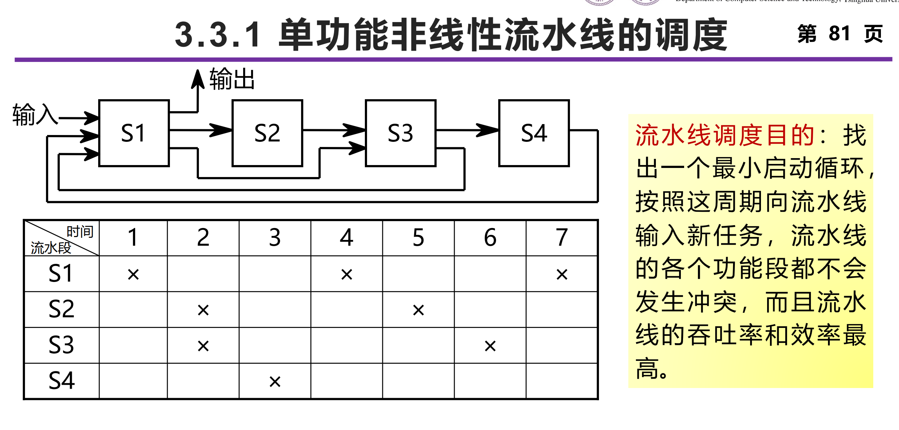
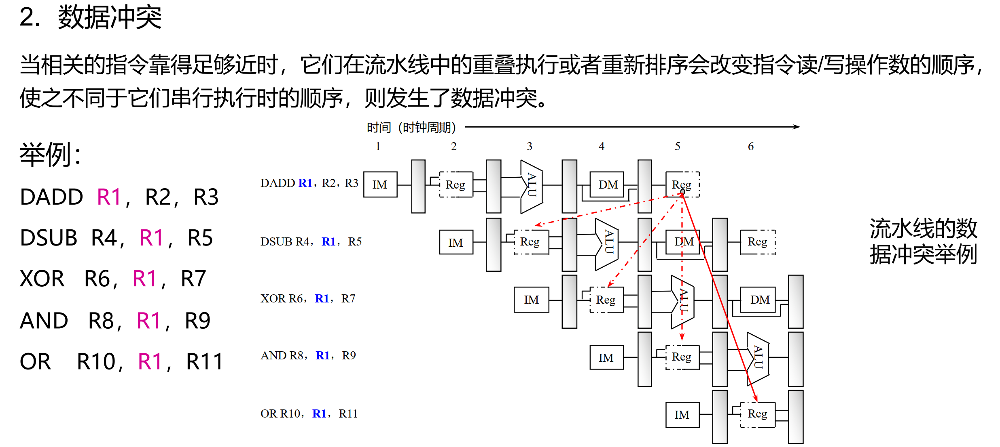
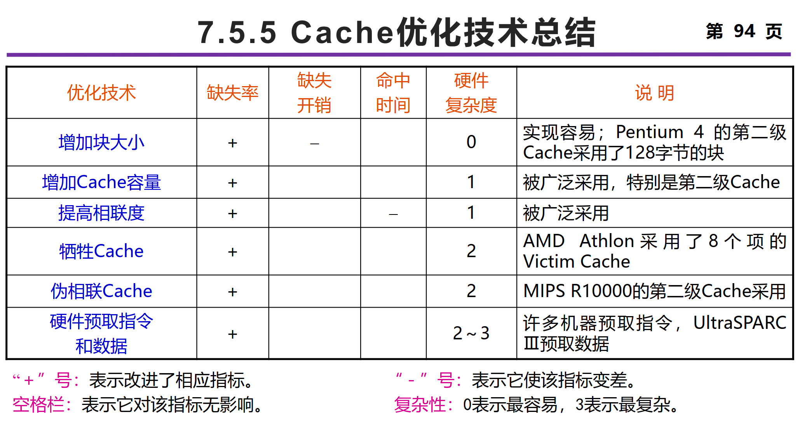

# 计系构面向知识点

###### 还有一天，真的真的复习不完了 qaq

## 基本概念&性能评价  

### 计算机系统结构的基本概念

#### 层次结构

个人理解：翻译先比解释，允许看前后更多的指令，也不要求翻译结果和高级指令保证一一对应关系

**微程序(microprogram)**  ：将一条机器指令编写成一段包含若干条微指令的微程序，由硬件来解释执行

**Risc指令系统直接解释执行第二级指令，没有微程序系统**！

操作系统机器：传统机器级指令+**操作系统级指令**  

#### 组成与实现  

**计算机组成**：计算机系统结构的**逻辑实现**  

- 包含物理机器级中的数据流、控制流的组成以及逻辑设计等
- 着眼于：物理机器级内各事件的排序方式与控制方式、各部件的功能以及各部件之间的联系

**计算机实现**：计算机组成的**物理实现**  

- 包括处理机、主存等部件的物理结构，器件的集成度和速度，模块、插件、底板的划分与连接，信号传输，电源、冷却及整机装配技术等
- 着眼于：器件技术（起主导作用）、微组装技术

**系列机**：由同一厂家生产的**具有相同系统结构**、但具有**不同组成和实现**的一系列不同型号的机器

#### Flynn分类法  

| 类型 | 特点                                                 | 典型                                |
| ---- | ---------------------------------------------------- | ----------------------------------- |
| SISD | 传统串行计算机，一个时钟周期仅处理一条指令和一条数据 | 早期的大型机 / 微型机 / 单核 PC     |
| SIMD | 所有处理器单时钟一条指令处理多条数据                 | 矩阵处理器 / 向量流水线             |
| MISD | 多个处理单元各自独立使用指令处理一条数据             | 实时容错计算机 / 单一信号多频滤波器 |
| MIMD | 每个处理器执行各自的指令和各自的数据                 | 超级计算机 / 集群服务器 /多核计算机 |

其他方式还有 冯氏分类法  、Handler分类法  

### 计算机系统的设计

#### Amdahl定律

$T_n = T_0(1-Fe+\frac{Fe}{Se}) \\ S_n = \frac{T_0}{T_n} = \frac{1}{1-Fe+\frac{Fe}{Se}}$

Fe:可改进的比例

Se:部件加速比

推论：

- Amdahl定律是一种性能改进的递减规则。如果仅仅对计算任务中的一部分做性能改进，则**改进得越多，所得到的总体性能的提升就越有限**  
- 如果只针对整个任务的一部分进行改进和优化，那么所获得的加速比**不超过 1/（1-Fe）**  
- 设计优化的原则：以**经常性事件**为重点 ，优化是指分配更多的资源、达到更高的性能或者分配更多的电能 

#### CPU性能公式  

$IC\times CPI \times 时钟周期长度$

IC：执行指令条数，取决于指令系统的结构和编译技术  

CPI：执行每条指令平均周期数，取决于计算机组成和指令系统的结构  

进一步细化，有n种指令

#### “自顶向下”或”由上往下“（top-down）设计  

从层次结构中的最上面一级开始，逐层往下设计各层的机器。首先，确定面对使用者的那级机器的基本特征、数据类型和格式、基本命令等。然后，再逐级往下设计，**每级都考虑如何优化上一级的实现**

**从中间开始设计**：首先要进行软、硬件功能分配，确定好这个界面；然后从这个界面开始，软件设计者开始往上设计操作系统、汇编、编译系统等；硬件设计者开始往下设计传统机器级、微程序机器级等

### 计算机系统的性能评测  

#### 执行时间和吞吐率

如何评测一台计算机的性能，与测试者看问题的角度有关。用户关心的是：**单个程序的执行时间**（执行单个程序所花的时间很少）数据处理中心的管理员关心的是：**吞吐率**（在单位时间里能够完成的任务很多 ）。

**二者并不是反比关系！**例如通过大量的并发处理，相同时间内可以处理很多任务，执行时间长但吞吐率高

#### 基准测试程序

把应用程序中用得最频繁的那部分核心程序或人工合成出来的程序作为评价计算机性能的标准程序，称为基准测试程序 （Benchmarks）

常见基准程序：SPEC，Whetstone与Dhrystone  

### 计算机系统结构的发展

### 计算机系统结构中并行性的发展  

时间重叠的基础：部件功能专用化

资源重复原理：多体交叉储器、多操作部件，指令级并行  

## 指令系统设计  

### 指令系统分类

堆栈结构：

累加器（accumulator）是一种寄存器，专门存放算术或逻辑运算的一个操作数和运算结果的寄存器。

通用寄存器（register）可用于传送和暂存数据，也可参与算术逻辑运算，并保存运算结果，有两种形式

根据ALU指令的操作数的两个特征对通用寄存器型结构进一步细分  

寄存器-寄存器型结构（RR结构  ）：

### 数据类型和数据表示

操作数表示方法：操作数类型由指令中的操作码指定，数据可以附上由硬件解释的标记  

### 寻址方式  

统计特征：**立即数寻址方式**和**偏移寻址方式**的使用频度最高

采用多种寻址方式可以显著地**减少程序的指令条数**，但可能**增加计算机的实现复杂度以及指令的CPI**——折衷方案。    

### 数据操作

- 数据传送类指令
- 算术运算指令
- 逻辑运算指令
- 程序控制指令

### 指令系统的设计与优化  

#### 哈夫曼编码

构造哈夫曼数，计算平均深度，理论编码长度为信息熵，信息冗余量为二者的差除以哈夫曼树平均深度

#### 扩展操作码  

#### 等长扩展码  

#### 定长操作码

在指令系统的设计中，要在**指令字长**与**寄存器个数**以及**寻址方式的个数**之间进行折中  

指令系统的3种编码格式： 可变长度编码格式、**固定长度编码格式（RISC）**、混合型编码格式。核心是看指令字长是否统一

### 指令系统的发展  

## 流水线技术基础  

### 流水线的基本概念  

- 工业流水线
- 时空图
  - 通过时间：第一个任务从进入流水线到流出结果所需的时间  
  - 排空时间：最后一个任务从进入流水线到流出结果所需的时间  
  - $T = (n+k-1)\times \Delta t$，n指令数，k流水线段数， $\Delta t$一段流水线的执行时间
- 连接图

- 部件级、处理器级和系统级流水线
  - **部件级流水线（运算操作流水线）**：把处理机中的部件分段，再把这些分段相互连接起来，使得各种类型的运算操作能够按流水方式进行
  - **处理器级流水线（指令流水线）**：把指令的执行过程按照流水方式处理。把一条指令的执行过程分解为若干个子过程，每个子过程在独立的功能 部件中执行  
  - **系统级流水线（宏流水线）**：把多台处理机串行连接起来，对同一数据流进行处理，每个处理机完成整个任务中的一部分

#### 单功能与多功能流水线

#### 静态与动态流水线

| 流水线类别 | 静态                                                         | 动态                                               |
| ---------- | ------------------------------------------------------------ | -------------------------------------------------- |
| 定义       | 在同一时间内，多功能流水线中的各段只能按同一种功             | 在同一时间内，多功能流水线中的各段可以按照不同的   |
| 优点       | 控制简单                                                     | 灵活，能够提高流水线各段的使用率，从而提高处理速度 |
| 缺点       | 能的连接方式工作流水线效率偏低，对于静态流水线来说，只有当输入的是连续相同的 | 方式连接，同时执行多种功能控制复杂                 |

**和单/多功能流水线的关系：静态流水线可以是单功能也可以是多功能的，动态流水线一定是多功能的！（同一时间内可以执行多个任务）**

#### 线性与非线性流水线

可以理解为线性流水线有唯一的预约表，因此通过连接图就可以看出

#### 顺序与乱序流水线

顺序流水线：流水线输出端任务流出的顺序与输入端任务流入的**顺序完全相同**。每一个任务在流水线的各段中是一个跟着一个顺序流动的

乱序流水线：流水线输出端任务流出的顺序与输入端任务流入的**顺序可以不同**，允许后进入流水线的任务先完成（从输出端流出）

#### 标量与向量流水线

#### 流水线的性能指标——吞吐率  

##### 情况一：各段时间相等

最大吞吐率实际上就是忽略了一开始通过和排空的时间

##### 情况二：各段时间不等

相比相等，计算 $(n-1)\Delta t$ 中的 $\Delta t$变为瓶颈段的时间，且前面的通过时间要考虑流水段各段用时不同带来影响，计算各段时间求和作为通过时间，而不是$ m \times \Delta t$

解决流水线瓶颈问题的常用方法 :细分瓶颈段（拆成n个串行流水段） ,重复设置瓶颈段(复制n个并行的流水段，从时空图上来看和细分瓶颈段类似，但控制逻辑更加复杂，硬件资源要求增加)  

#### 流水线性能指标——加速比

##### 情况一：各段时间相等

**流水线段数是否越多越好？**错，当流水线段数增加时，**需要连续输入的任务数也必须增加**，**资源占用和功耗增加**，**流水线中的数据依赖和冲突增加**，**控制流的复杂性增加**  

##### 情况二：各段时间不等

#### 流水线性能指标——效率  

### 非线性流水线的调度

只考单功能非线性流水线的调度

**求最小启动循环算法：**

1. 由预约表得到禁止集合：找同一行x之间的间隔，注意如果有超过两个x的话要两两匹配的找间隔
2. 由禁止集合得到冲突向量：冲突向量用一个m位的二进制数表示（其中m是禁止向量中的最大值），一般格式为C=（CmCm-1…Ci…C2C1）。若i在禁止集合中，则Ci =1；否则Ci =0，其中Cm一定为1  
3. 由冲突向量构造调度流水线的状态图：这里看课件例子，核心是注意只看右移出0的，并且是和原始向量异或
4. 步骤四：在状态图中找出可用启动距离，并计算平均启动距离：找出所有简单循环
5. 找出平均启动距离最小的启动循环或恒定循环 

多功能非线性流水线调度：应该不考

### 流水线的相关与冲突  

#### 相关

数据相关、名相关、控制相关

#### 冲突

结构冲突、数据冲突、控制冲突

#### 总结

| 相关类型 | 定义                                                         | 具体例子                         | 解决方法                                |
| -------- | ------------------------------------------------------------ | -------------------------------- | --------------------------------------- |
| 数据相关 | 靠后的指令用了靠前指令的结果，满足传递性                     | RAW                              |                                         |
| 名相关   | 两条指令使用相同的名，但是它们之间并没有数据流动             | 反相关（WAR）  ，输出相关（WAW） | 换名技术，可以通过编译器 或者硬件来实现 |
| 控制相关 | 由分支指令引起的相关，为了保证程序应有的执行顺序，必须严格按控制相关确定的顺序执行 | if-then结构                      |                                         |

| 冲突类型 | 定义                                                         | 具体例子                                                     | 解决方法                                                     |
| -------- | ------------------------------------------------------------ | ------------------------------------------------------------ | ------------------------------------------------------------ |
| 结构冲突 | 因硬件资源满足不了指令重叠执行的要求而发生的冲突             | 流水线不同功能段访问同一个存储器                             | 设置相互独立的指令存储器和数据存储器或设置相互独立的指令Cache和数据Cache ，但这样会带来额外的硬件开销。还可以插入暂停周期（“流水线气泡”或“气泡”） |
| 数据冲突 | 当指令在流水线中重叠执行时因需要用到前面指令的执行结果而发生的冲突 | 写后读冲突（RAW）  ，写后写冲突（WAW） ， 读后写冲突（WAR）    。**其中WAW冲突只发生在流水线种不只有一个段可以写，或者指令被重新排序的情况下。WAR只发生在写操作提前/读操作滞后，或者指令被重新排序的情况下** | 可以通过定向技术或者停顿来解决（定向技术无法解决LD类的RAW冲突），还可以让编译器重新组织指令顺序来消除冲突，这种技术称为指令调度或流水线调度 |
| 控制冲突 | 流水线遇到分支指令和其它会改变PC值的指令所引起的冲突。       | 分支指令                                                     | 冻结”或者“排空”流水线  ，通过尽早判断出分支转移是否成功 和 尽早计算分支目标地址来减少分支延迟 |

**相关是程序的固有属性，冲突则和流水线的实现有关！**

### 流水线最佳段数选择

## 指令级并行的开发——软件方法  

### 基本指令调度及循环展开

#### **指令调度**

找出不相关的指令序列，让它们在流水线上重叠并行执行  

制约编译器指令调度的因素 ：

- **程序**固有的指令级并行  
- **流水线**功能部件的延迟  

#### 循环展开  

把循环体的代码复制多次并按顺序排放， 然后相应调整循环的结束条件  

**结论：通过循环展开、寄存器重命名和指令调度，可以有效开发出指令级并行**  

#### 注意事项

### 跨越基本块的静态指令调度

#### 全局指令调度  

在保持原有数据相关和控制相关不变的前提下，尽可能地缩短包含分支结构的代码段的总执行时间。

- 单发射处理器——减少指令数
- 多发射处理器——缩短关键路径长度

#### 踪迹调度  

优化执行频率高的踪迹，减少其执行开销。

仅当**不同踪迹的执行频率差别较大且各条踪迹的执行频率受输入集的影响较小**（补偿代码小）时，才能取得较好的效果

#### 超块调度

超块构造——尾复制技术

### 静态多指令发射

## 线程级并行  

## 数据级并行（向量处理）  

### 向量的三种处理方式  

| 处理方式 | 横向                                                         | 纵向                                                         | 纵横                                                         |
| -------- | ------------------------------------------------------------ | ------------------------------------------------------------ | ------------------------------------------------------------ |
| 定义     | 又称水平处理方式，横向加工方式等，向量计算是按行的方式从左至右横向地进行 | 又称垂直处理方式，纵向加工方式等，向量计算是按列的方式自上而下纵向地进行 | 又称分组处理方式，纵横加工方式等，横向处理和纵向处理相结合的方式 |
| 特点     | 1.  在计算向量的每个分量时，都发生写读数据相关，流水线效率低；如果采用多功能流水线，必须频繁进行流水线切换  2. 横向处理方式对向量处理机不适合。即使在标量处理机中，也经常通过编译进行指令流调度 | 1.这种处理方式适合向量处理机实现  2.数据相关不影响流水线连续工作  3.不同的运算操作只需要切换1次 | 现有问题：向量长度不固定，对存储系统要求高，且系统不灵活     |
|          |                                                              |                                                              | 解决方法：用于寄存器-寄存器结构的向量处理机中，向量寄存器的长度是有限的 |

### 向量处理机的结构

  

### 提高向量处理机性能的常用技术  

#### 设置多个功能部件  

#### 向量链接  

具有先写后读相关的两条指令，在不出现功能部件冲突和源向量冲突的情况下，可以把功能部件链接起来进行流水处理，以达到加快执行的目的。

结果寄存器可作为后继指令的操作数寄存器，在CRAY-1中这种技术被称为两条流水线的链接  

#### 编队  

把能在同一个时钟周期内一起开始执行的几条向量指令称为一个编队（convoy）  

#### 循环开采  

### 向量处理机的性能评价方法  

#### 峰值性能

当向量长度为无穷大时，向量处理机的最高性能，也称为峰值性能  

#### 半性能向量长度n1/2  

**向量处理机的性能为其最大性能的一半时所需的向量长度**  

#### 向量长度临界值nv  

## 存储系统

### 存储系统层次架构

  

#### 局部性原理（Principle of locality ）

### 层次存储的 4 个基本问题  

#### 放置策略

#### 查找策略

#### 替换策略

#### 写策略

- “写”操作必须在确认是命中后才可进行
-  “写”访问有可能导致Cache和主存内容的不一致

### Cache 缺失原因

#### 强制缺失

当第一次访问一个块时，该块不在Cache中，需从下一级存储器中调入Cache，这就是强制性缺失。 (冷启动缺失，首次访问缺失）  

#### 容量缺失

如果程序执行时所需的块不能全部调入Cache中，则当某些块被替换后，若又重新被访问，就会发生缺失。这种缺失称为容量缺失  

#### 冲突缺失

在组相联或直接映象Cache中，若太多的块映象到同一组(块)中，则会出现该组中某个块被别的块替换(即使别的组或块有空闲位置)，然后又被重新访问的情况。这就是发生了冲突缺失。(碰撞缺失，干扰缺失  

#### 一致性缺失

### Cache性能

$AMAT = HitTime + MissRate \times MissPenalty$

#### 降低缺失率

三种损失及对应的解决方法

| 缺失类型     | 优化方法                       |
| ------------ | ------------------------------ |
| 强制缺失     | 大的 Cache 块                  |
| 冲突缺失     | 提高相联度，Way-预测，编译优化 |
| 容量缺失     | 编译优化                       |
| 减少缺失次数 | 大的 Cache                     |

**伪相联**存在变化的命中时间对CPU流水线影响大**适合离CPU远的Cache**  

其它方法：牺牲者Cache，硬件预取

#### 减少缺失代价

多级 Cache

Critical Word First and Early Restart  

尽早重启动  + 关键字优先

在Cache块较小  或者下一条指令正好访问同一Cache块的另一部分  时收益不大

Giving Priority to Read Misses over Writes  让读不命中优先于写

Merging Write Buffer  

Victim Caches  

#### 减少Cache命中时间

物理Cache：地址转换和访问Cache串行进行，访问速度很慢  

虚拟Cache：在命中时不需要地址转换，省去了地址转换的时间。即使缺失，地址转换和访问Cache也是并行进行的，其速度比物理Cache快很多，可能存在歧义（ambiguity）和别名(alias)  问题  

## 互联网络

### 互联函数

恒等函数、交换函数、均匀洗牌函数、逆均匀洗牌函数、碟式函数、反位序函数、移数函数、PM2I函数等  
