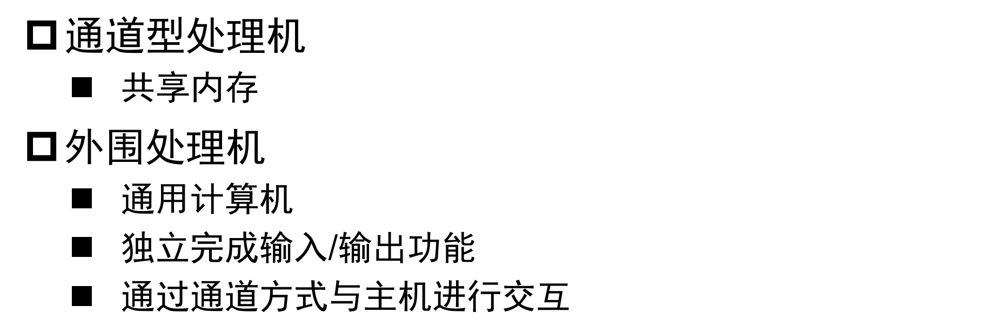

# 计组知识点整理

> 开辟鸿蒙，女娲补天qaq

> 一学期 verilog 写了个这个？

## 11 计算机系统概述

**历史**

**图灵机：**奠定了现代计算机的理论基础。  

- **通用**计算机： 确定了现代计算机的理论基础  
- **存储程序**计算机： 问题的求解由程序或过程给出，程序和过程可以通过语言描述  
- 有限速度： 计算机执行程序的时间是有限的  
- 有限空间： 计算机程序的存放空间和数据存放空间也是有限的。  

**运行机制**

## 12-13 指令系统

### 指令系统概念

- **冯诺依曼结构：** **存储程序计算机**（用指令序列在存储器中顺序存放，表示程序功能） + **顺序执行指令**（PC指向需要执行的指令，读取完成后自行跳转，一般是自增）
  - 数据和指令一起存储（对比哈佛结构，分开存储）
- **计算机系统**：**硬件**（中央处理器、 存储器以及外围设备）+**软件**（各种系统的和用户的程序），指令是计算机运行的最小的功能单元，多条指令可以组成一个程序

**计算机系统层次**：指令系统层处在硬件系统和软件系统之间， 是硬、 软件之间的接口部分，指令系统优劣是一个计算机系统是否成功的关键因素。

### 指令

按照功能分为

- 数据运算指令（算数运算， 逻辑运算  ）  
- 数据传输指令  （内存/寄存器， 寄存器/寄存器  ）
- 控制指令  （无条件跳转， 条件跳转， 子程序的支持（调用和返回）  ）
- 输入输出指令  （与输入输出端口的数据传输（输入输出模型如何）  ）
- 其它指令（停机、 开/关中断、 空操作、 特权指令、 设置条件码  ）

**指令格式**

- **指令字**： 完整的一条指令的二进制表示  

- **指令字长**： 指令字中二进制代码的位数（字节的整数倍），根据指令字长是否固定可以分为**定长&变长指令字结构**，**指令操作码的位数限制指令系统中的指令条数**

- **指令操作数个数**：n个操作数的指令称为 **n地址指令**

- **操作码**：操作码长度决定该类指令的指令数量，但需要注意的是cpu自己不会区分m地址码和n地址码，在指定操作码的时候需要留出对应的空间（如把跟短操作码的全1留给更长操作码），比如下面这个例子

  

- 寻址方式：
  - **直接寻址**：在指令的地址码字段， 直接给出所需的操作数(或指令) 在存储器中的地址。
  - **寄存器寻址/寄存器间址**：寄存器里存储真正的地址/存储真正地址的地址
  - **变址寻址**：变址寄存器 + 指令中的变址偏移量  
  - **相对寻址**：PC + 指令中的变址偏移量  
  - **间接寻址**：指令中存了一个地址，地址指向存储器内部一个值，这个值才是存储了真正操作数的地址，多一次读内存储器的操作  
  - **基址寻址**： 基址寄存器 + 指令中的变址偏移量
  - **堆栈寻址：**SP +   指令中的变址偏移量  

### RISC-V指令系统  

特点：指令集架构简单  + 模块化的指令集设计

**规整的指令编码**

  

**特权模式**

**伪指令**

纯粹提供语法糖

基于 `auipc` 和 `lui` 实现32位地址的读取加载

函数调用

## 14 数据表示及检错纠错  

### 数据的编码与表示

逻辑型数据，字符型数据（ASCII，UNICODE，UTF-8），数值型数据（定点数，浮点数）

- 整数表示：
  - 原码：符号位+数的绝对值
  - 反码：正数不变，负数除了符号位每位取反
  - 补码：正数不变，负数除了符号位按位取反+1
  - 一些特殊情况：0有两种原码表示和反码表示（原码为1000 0000 和 0000 0000），但只有一种补码表示（0000 0000），不能说负数原码反码补码都不相同（原码为1100 0000，补码还是这个数）

- 浮点数：

### 检错纠错码

码距（最小码距） 的概念： 是指任意两个合法码之间至少有几个二进制位不相同。  

合理增大码距， 能提高发现错误的能力，但会增加电子电路的复杂性和数据存储、数据传送的数量。

#### 奇偶校验

使K+1 位码字中取值为1 的位数总保持为偶数（偶校验） 或奇数（奇校验） 。

单检错，码距为2

#### 海明校验码

从崔勇ppt抄过来的方法，可以用来算校验位，计组还要求有全局校验位，就是对全局做偶校验

单纠错双检错，码距为4（要实现单纠错只要满足 $s^r \geq k+r+1$ 即可，要实现双检错还需要 $2^{r-1}\geq k+r$）

## 15 算术运算及电路实现  

### 二进制乘法

#### 原码乘法

**版本一**：把$n\times m$位的惩罚看作是 $m$ 个 $n$ 位数相加

不足：

- 被乘数的一半存储的只是0，浪费存储空间
- 每次加法实际上只有一半的位有效，浪费了计算能力  

**版本二：**  被乘数和alu改成32位，乘积右移

**版本三：**乘积和乘数合起来变成一个64位的寄存器，每次完成一位的乘法以后，二者同时右移

#### 补码乘法（布斯算法）

原理：$[x]_补=x_{n-1}x_{n-2}\cdots x_0$，则 $x = -2^{n-1}x_{n-1} + \sum_{i=0}^{n-2}x_i2^i$，相当于最高位为1时，x为负数

因此补码乘法可以转化为

### 二进制除法

这里应该是首先要把X和Y都转化成正数，每次根据余数的符号确定那一位商的然后再左移，如果商0则+Y否则减Y

## 21 指令格式与数据通路  

### Riscv指令格式

- S类型指令为什么不把rs2用作imm的低位 ？——RISC-V设计让rs1和rs2的位置保持固定，RISC-V 设计策略： 让寄存器位置保持不变  
- B类型指令可以指定$\plusmn 12KB$ 的**2字节对齐**地址范围
- JAL和JALR的区别在于前者是相对寻址（基于PC）而后者是变址寻址（基于给定的寄存器）

### 数据通路

执行每条指令平均使用的CPU周期个数被称为**CPI**

- 单周期CPU：$CPI=1$
- 多周期CPU：$CPI\approx 4$，因为大多数指令没有MEM
- 流水线CPU：尖峰CPI=1

## 22 单周期 CPU

五个阶段：

- 读取指令(IF), 从存储器读来指令并形成下条指令地址  
- 指令译码(ID), 指令译码，读寄存器堆为ALU准备数据  
- 执行运算(EXE),ALU 执行数据运算或计算存储器地址  
- 存储器读写(MEM),完成存储器的读操作或者写操作  
- 写回(WB), 写ALU的结果或存储器读出数据到寄存器堆  

优点：

- 每条指令占用一个时钟周期  
- 逻辑设计简单，时序设计也简单  

缺点：

- 各组成部件的利用率不高  
- 时钟周期应满足执行时间最长指令的要求  

控制信号

## 23 多周期 CPU

## 24 流水线 CPU

分类：

- 部件功能级流水线：运算操作流水线（Arithmetic Pipelines）
- 处理机级流水线：指令流水线（Instruction Pipelines）  
- 处理机间级流水线：宏流水线（Macro Pipelines）   

性能指标：

- 吞吐率：单位时间内执行的指令数量
- 加速比：与串行执行时速度提高的比率
- **最佳段数**

## 25-26 冲突处理

三种冲突：

- **结构冲突**：指令在重叠执行的过程中，硬件资源满足不了、指令重叠执行的要求，发生硬件资源冲突而产生的冲突。
- **数据冲突**：指在同时重叠执行的几条指令中，一条指令依赖于前面指令执行结果数据，但是又得不到时发生的冲突。
- **控制冲突**：分支指令或者其他需要改写PC的指令造成的冲突。

### 结构冲突

**寄存器结构冲突**：两个指令同时对寄存器堆读和写。**解决办法**：通过独立的读和写端口进行支持，双边沿访问（FPGA做不到）

**内存结构冲突：**在同一个周期内读取/写入内存两次。**解决办法：**暂停流水线 or 将指令内存和数据内存分开哈佛结构or双端口存储器……

### 数据冲突

- 写后读（RAW）：靠后的指令在靠前的指令将结果写入寄存器之前就把寄存器的值读了出来
- 写后写（WAW）：靠后的指令在靠前的指令将结果写入寄存器之前就把寄存器的值写入了
- 读后写（WAR）：靠后的指令在靠前的指令读取寄存器之前就把寄存器的值写入了

Risc-V指令流水线不会出现后两种情况！
**解决方法：**

- 暂停流水线：译码期间检测冲突
- 汇编器assemble或者程序员放一条不相关的指令，避免冲突（软件层面插入气泡）

- 数据旁路

​    **不能通过数据旁路解决所有冲突！（Load-Use Case）**

- 调换代码顺序来避免流水线暂停（动态调度）：指令顺序发射——乱序执行——指令乱序流出  ，可能导致的问题：异常处理的不精确性。  

### 控制冲突

分支指令

**普通解决方法**：暂停流水线，需要两个周期处理（往届笔记说是传入PC+进入IF，群里答疑老师的意思是WB阶段写回，感觉都不太靠谱）

减少暂停：

- 在流水线中尽早判断出分支转移是否成功  
- 尽早计算出分支成功转移时的PC值  

**Branch Taken：**在ID阶段就算出newPC，在EXE阶段再判断是否跳转，可以少一个周期

**分支预测：**译码阶段即预测，然后根据预测的结果是否跳转决定是否跳转至分支目标（下面的成功，不成功都是指预测的分支跳转结果，而不是和真实结果的比较），如果预测正确，则不会在性能上有任何损失，如果预测错误，则需要消除影响

**动态预测**：BTB表记录跳转目标，BHT的位数为n记录了之前n次执行到这条跳转发生与否，**BHT体现了动态性**

## 27 异常处理

RISC-V的特权级模式：

- **用户模式（user mode）** ： 执行用户应用程序的模式，本学期的大部分指令都执行在用户模式  
- **机器模式（machine mode）** ： 运行最可信的代码，直接接触硬件  
- **监管者模式（supervisor mode）** ： 为现代操作系统例如Linux等提供支持  

异常分类：

- **同步异常**： 执行期间产生， 访问无效的寄存器地址， 或者执行了具有无效操作码的指令，包括：访问错误异常，断点异常，环境调用异常，非法指令异常，非对齐地址异常  
- **异步异常**： 指令流异步的外部事件， 中断， 如鼠标点击  

**中断源**：

- **软件中断**： 通过向内存映射寄存器写入数据来触发，用户一个hart中断另外一个hart（处理器间中断)
- **时钟中断**： 实时计数器mtime大于hart的时间比较寄存器mtimecmp， 会触发时钟中断  
- **外部中断**： 由中断控制器触发， 大部分情况下的外设都会连到这个中断控制器 

## 31-32 层次存储结构

存储器设计目标：

- **大容量**：静态存储器速度高，设置较小容量的高速缓冲存储器  
- **高速度**：动态存储器价格适中， 速度适中，可作为主存储器  
- **低成本**：磁盘存储器价格低廉，作为辅助存储器， 暂存CPU访问频率不高的数据和程序，作为虚拟存储器的载体      
- **高可靠性**

程序运行的局部性原理：时间，空间，顺序

层次间满足的原则：

- **一致性原则**： 处在不同层次存储器中的同一个信息应保持相同的值。
- **包含性原则**： 处在内层的信息一定被包含在其外层的存储器中， 反之则不成立, 即内层存储器中的全部信息， 是其相邻外层存储器中一部分信息的复制品

### 动态存储器 DRAM

**工作特点：**容量大，速度慢，能耗低，成本低

- **破坏性读出**：读操作后， 被读单元的内容**一定被清为零**，必须把刚读出的内容立即写回去， 通常称其为**预充电延迟**，它影响存储器的工作频率， 在结束预充电前不能开始下一次读。
- **需定期刷新**：在不进行读写操作时， DRAM 存储器的各单元处于断路状态， 由于**漏电**的存在， 保存在电容CS上的电荷会慢慢地漏掉， 为此必须定时予以补充， 通常称其为**刷新操作**。刷新不是按字处理， 而是**每次刷新一行**， 即为连接在同一行上所有存储单元的电容补充一次能量。  
  - **集中刷新**， 停止内存读写操作， 逐行将所有各行刷新一行
  - **分散刷新**， 每一次内存读写后， 刷新一行， 各行轮流进行。或在规定的期间内， 如 2 ms ， 能轮流把所有各行刷新一遍  
- **快速分页组织**：**行、 列地址要分两次给出**， 但连续地读写用到相同的行地址时，也可以在前一次将行地址锁存， 之后仅送列地址， 以节省送地址的时间， 支持这种运行方式的被称为**快速分页组织的存储器** 

时序图：

### 静态存储器 SRAM

SRAM与DRAM的区别：SRAM是触发器保存，因此不会破坏性读出也不要刷新，它的行列地址是同时送的  

## 32-33 高速缓冲存储器 Cache

原理：

- **时间局部性**：最近被访问的信息很可能还要被访问  
- **空间局部性**：最近被访问的信息临近的信息也可能被访问。  

**高速缓冲存储器**：设置于主存和CPU之间的存储器，**用高速的静态存储器实现**，缓存了CPU频繁访问的信息  

**特点**：高速（与CPU的运行速度基本匹配），透明（完全硬件管理，对程序员透明）

**要解决的问题：**

- **地址和Cache行之间的映射关系**：  如何根据主存地址得到Cache中的数据？  
- **数据之间一致性**：Cache中的内容是否已经是主存对应地址的内容？  
- **数据交换的粒度**：Cache中的内容与主存内容以多大的粒度交换？  
- **Cache内容装入和替换策略**：如何提高Cache的命中率？  

### 全相联

1组n路

- 主存的字块可以和Cache的任何字块对应，利用率高，方式灵活。  

- **标志位较长**，**比较电路的成本太高**。如果主存空间有$2^m$块，则标志位要有m位。 

  同时，如果Cache有n块，则需要有n个比较电路。  

**成本高**

### 直接映射

n组1路

- **主存的字块只可以和固定的Cache字块对应**，方式直接，**利用率低**  

- 标志位较短，**比较电路的成本低**。如果主存空间有$2^m$块， Cache中

  字块有$2^c$块，则标志位只要有$m-c$位。 且仅需要比较一次  

**利用率低，命中率低，效率较低**  

### 多路组相联

需要注意的地址被划分为标记位、组索引和块内地址，即tag | set index | block offset，与直接映射划分方式相同。  index往后放有利于让缓存分布得更均匀，避免了某一个set挤满得情况

cache命中过程描述：取地址对应index的位，根据CI访问Cache，将地址中的CT取出来和cache对应CI这一行的每一项tag比较，如果相等==且valid==，则命中并返回数据，如果都不匹配则返回miss

#### **一致性保证**  

- 写直达（Write through）
  - 强一致性保证，效率低
  - 在Cache中命中
    - 同时修改Cache和对应的主存内容
  - 没有在Cache中命中
    - 写分配（Write allocate）
    - 非写分配（not Write allocate）
- 拖后写（Write back）
  - 弱一致性保证，替换时再写主存
    - 主动替换
    - 被动替换
  - 通过监听总线上的访问操作来实现
  - 实现复杂，效率比较高

**多核一致性：**

- **修改态（M）**：处于这个状态的cache块中的数据已经被修改过，和主存中对应的数据已不同，只能从cache中读到正确的数据
- **独占态（E）**：处于本状态的cache块的数据和主存中对应的数据块内容相同，而且在其它cache中没有副本
- **共享态（S）**：处于本状态的cache块的数据和主存中对应的数据块内容相同，而且可能在其它cache中有该块的副本
- **无效态（I）**：处于本状态的cache块中尚未装入数据

#### **提高存储访问的性能**  

**四类缺失：**

| 缺失类型                        | 解释                                                         | 应对策略                  |
| ------------------------------- | ------------------------------------------------------------ | ------------------------- |
| **必然缺失**（Compulsory Miss） | 开机，首次访问                                               | 预取                      |
| **容量缺失**（Capacity Miss）   | 活动数据集超出了Cache的大小                                  | 增加cache容量             |
| **冲突缺失**（Conflict Miss）   | 多个内存块映射到同一Cache块；某一Cache组块已满，但空闲的Cache块在其他组 | 增加个cache容量，增加路数 |
| **无效缺失**                    | 其他进程修改了主存数据                                       |                           |

**块大小的权衡**：增加块的大小可以更好地利用空间局部性，但会减少数据块儿数量，命中率降低

**替换策略**

- 最近最少使用LRU：满足程序局部性要求 ，命中率高但硬件实现复杂  
- 先进先出FIFO：满足时间局部性，实现简单
- 随机替换RAND：其实还行

**多级cache**

#### Cache 接入系统的体系结构

- **侧接法**：像入出设备似的连接到总线上，优点是结构简单，成本低，缺点是不利于降低总线占用率。
- **隔断法**：把原来的总线打断为两段，使 CACHE 处在两段之间，优点是有利于提高总线利用率，支持总线并发操作，缺点是结构复杂，成本较高  

## 34 虚拟内存 （这部分做题的话还是得看csapp）

使用虚拟内存的目的

- 容量：获得运行比物理存储器更大空间程序的能力  
- 存储管理：内存的分配以及虚实地址转换  
- 保护：操作系统可以对虚拟存储空间进行特定的保护  
- 灵活：程序的某部分可以装入主存的任意位置  
- 提高存储效率：只在主存储器中保留最重要的部分  
- 提高并行度：在进行段页替换的同时可以执行其它进程  
- 可扩展：为对象提供了扩展空间的能力  

**页式存储管理：**page size固定（以byte为单位），将主存、虚存按页划分，通过页表进行管理。

**页面大小：**减小了可以减少内部碎片（没有用到的部分），但是需要增大页表，所以趋势是增大页面大小。

**页面替换算法：**OS读页表（一般是TLB miss后）发现需要的页未装入主存，则指示CPU访问外存，从外存调入页到主存，若主存已满则进行页面替换，修改完了返回。使用最近最少使用（LRU）  策略

- 将页帧按照最近最多使用到最近最少使用进行排序， 再次访问一个页帧时， 将该页帧移到表头， 替换时将表尾的页帧换出。
- 一点改进： 替换出其中一个“干净” 的页帧。（脏页表很有可能被再次访问）

**虚实地址转换**：虚地址=虚页号+页内地址，实地址=实页号+页内地址  

**转换旁路缓冲（TLB）** 

TLB缺失将导致：流水线停止，通知OS，OS读页表，将页表项写回TLB，返回用户态，重新访问。  

减少缺失的方法：多路组相连、提高TLB容量  

**段式存储管理**

是段式虚拟存储器和页式虚拟存储器的综合。它先**把程序按逻辑单位分为段**，再**把每段分成固定大小的页**。操作系统对主存的**调入调出是按页面进行**的，但它又可以**按段实现共享和保护**，可以兼取页式和段式系统的优点。其缺点是需要在地址映射过程中多次查表。其地址映射通过一个段表和一组页表来进行。    

## 35 外存储器 Disk

### 磁盘访问过程

- **寻道**：将读写磁头移动到正确的磁道上（平均需要8~20 ms ）
- **寻找扇区（旋转延迟）**：等待磁盘旋转到需要访问的扇区（.5 / RPM）
- **数据传输**：读写数据（1个或多个扇区）（ 2 to 15 MB/sec）  

**磁盘访问时间计算**：磁盘访问时间 = 寻道时间 + 旋转延迟（**并不做特殊要求这里算1/2圆周**）

+ 传输时间（**读取大小/传输速度**）+磁盘控制器延迟

**扇区小的原因**：

- 可用性。 可以在扇区物理损坏时不再使用该扇区  
- 可用性。检错纠错码分布在每个扇区，扇区容量小，检错速度快，效率高  
- 灵活性。 使用不同的操作系统，不同的页面大小。  

**访问磁盘的过程**：

**可靠性核可用性**：

- **可靠性**：设备出现故障的几率来衡量。  （偏物理层面，比如让部件更牢靠，环境更稳定之类的）
- **可用性**：系统能正常运行的几率来衡量 。（偏数据层面，比如增加校验码等）

### RAID

廉价磁盘的冗余阵列（Redundant Arrays of Inexpensive Disks）

#### RAID0  

没有冗余，可靠性差

#### RAID1

- 冗余备份，可靠性高
- 写性能不高（虽然也是并行地写，但写入时间取决于较慢的哪一个），但**读性能却提高了两倍**
- 成本较高  

#### RAID2

增加了字/字节层面的海明码校验

- 驱动器必须同步旋转  
- 驱动器个数要足够多  
- 需要多个控制器  

#### RAID3

把海明码换成奇偶校验，仍需确保同步旋转

#### RAID4

- 不对字进行校验，也不需要驱动器同步  
- 可以防止整块盘崩溃，但对盘上部分字节数据出错的纠错性能相当差  
- 校验盘负载沉重  

#### RAID5

为减少校验盘的负载，将校验位循环均匀分布到所有的驱动器上  

#### RAID6

二维校验

### 固态硬盘 SSD 

用固态**电子存储**芯片阵列而制成的硬盘，由控制单元和存储单元（FLASH芯片、 DRAM芯片）组成  

**不同操作粒度**：

- 以页的方式读写  
- 以块的方式擦除  

擦除次数有限：需要磨损均衡  

**FTL(Flash Translation Layer)**:

- 逻辑地址到物理地址的转换  
- 磨损均衡  
- 垃圾回收:  垃圾回收开销 = 擦除开销 + 页面移动开销  

## 41 io

需要解决的问题：

- 控制方式：CPU如何控制输入/输出？  
- 传输方式：传输通道、方式、速率等（总线、接口）  
- 数据识别和转换：数/模转换、语音识别等，转换为字符、数据等计算机能识别的格式（设备）

### 输入输出方式

- **程序直接控制**：轮询，成本低，效率低，占用cpu资源

- **程序中断**：外部设备发起请求->CPU暂停正在执行的程序，进行响应->处理完成后，继续执行原来的程序。可以提高CPU效率，可以同时管理多个设备

  

  

- **直接存储访问（DMA）**：外设和主存储器直接相连，是为外设专设的硬件，用于**高速外设**和**主存**之间【**成组传送**】数据。传送开始前＆结束后都通过**程序 or 中断方式**使CPU对DMA进行预处理和后处理，但传送时CPU是不被影响的，可以继续执行主程序。  

  - **独占总线**：当外设要求传送一批数据时，由DMA控制器发一个信号给CPU。 DMA控制器获得总线控制权后，开始进行数据传送。一批数据传送完毕后， DMA控制器通知CPU可以使用内存，并把总线控制权交还给CPU。  
  - **周期挪用（周期窃取）**：当I/O设备没有 DMA请求时， CPU按程序要求访问内存：一旦 I/O设备有DMA请求，则I/O设备挪用一个或几个周期。（随时，一旦冲突， DMA优先）
  - **DMA与CPU交替访内**：一个CPU周期可分为2个周期，一个专供DMA控制器访内，另一个专供CPU访内。不需要总线使用权的申请、建立和归还过程。  
  - 特点：与设备一对一服务 ，对CPU打扰适中，**无法适用大量高速设备的管理**  

  

- **通道控制方式：**I/O通道是计算机系统中代替CPU管理控制外设的独立部件，是一种能执行有限I/O指令集合——通道命令的I/O处理机。
  - 一对多的连接关系，可以并行工作 
  - 通道类型包括：字节多路通道（简单的共享通道，适合中低速设备），选择通道（效率高，适合快速设备  ），数组多路通道（效率高，控制复杂）  

- **外围处理机**

    

## 42 总线

**使用总线的好处**：统一标准、降低成本、简化设计；【**缺点**】总线容易成为瓶颈，限制吞吐量  

总线的最高速度主要由下列因素决定：  

- 总线长度  
- 总线负载的设备数  
- 负载设备的特性  

### 总线的类型

**单总线计算机**： 主板总线 ，特点：简单，效率低 

**双总线系统：**输入/输出总线通过适配器和处理器-主存总线相连

  

**三总线系统：**  主板总线连接到处理器-主存总线，处理器-主存总线主要用于处理器和主存之间数据交换，I/O总线连接到主板总线。**大大减小了处理器-主存总线负载**  

**总线的一般组成**：控制线（信号和信息类型）、数据线（数据和地址）  

### 总线事务

发起命令，传输数据  

- 主设备：总线事务发起者，发出命令（和地址）  

  - 集中仲裁  

    - 菊链仲裁：所有设备共用一个总线请求信号  ，简单但不公平，逐级传递影响速度

      

    - 集中平行仲裁：

      

  - 分布仲裁  

  - 其他总线仲裁的划分方式：优先级仲裁 / 轮循仲裁  

- 从设备：总线事务的响应者  

### 总线工作方式

- 同步总线，根据时钟信号 => 为防止信号扭曲，总线距离需要比较短  
- 异步总线，距离可以长，使用握手协议  

### 增加总线带宽  

- 增加每个周期传送数据的量 （增加成本）
- 分为地址总线和数据总线（增加成本）
- 采用成组传送方式  （复杂度提高，延长后续总线请求的等待时间  ）
- 多主设备总线提高事务数量：仲裁重叠（在当前事务时， 为下一总线事务进行仲裁），总线占用 （在没有其他主设备请求总线的情况下， 某主设备一直占用总线， 完成多个总线事务），地址、 数据传送重叠  

### PCI

## 43 接口电路和外部设备  

**接口**：总线和外部设备的连接，基本功能有  

- 使主机能根据**设备编号**找到外设  
- 使主机能**控制**设备并与之通信  
- 提供主机和设备之间的**数据缓冲**机制

USB采用同步传输方式，因此USB帧还设置有同步帧，用于同步    

