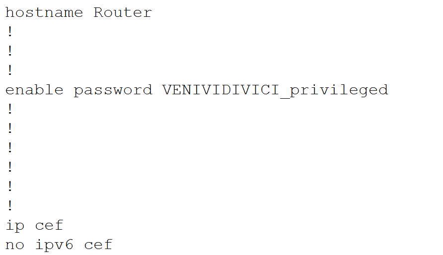
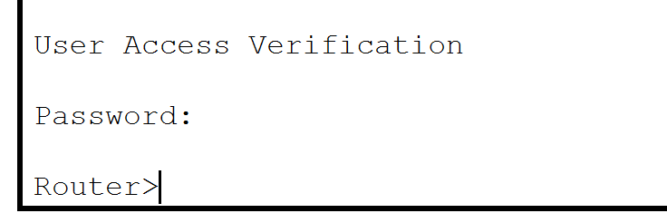

# Lab1-report

###### 计11班 周韧平 2021010699

## 任务一

三处污损地方分别为：

- Router3：10.0.2.1
- PC3：192.168.3.2
- Laptop2: 192.168.2.1

Router2的端口2有错误，20开头属于公网ip地址，不应该用于私人子网搭建，因此应该改为10.0.2.2

## 任务二

使用2811型号路由器搭配 NM-1E 模块，其它设备均按照拓扑图给出的搭建

Router0设定

Router1设定

Router2设定

其它设备（除了交换机外）按照任务一中给出的表格设置ip地址和默认网关

在等待一段时间让rip协议收敛后，可以在PC1上ping通同一子网内的设备，也可以ping通另一个子网内的设备（PC3）

## 任务三

根据提示，”YHQL, YLGL, YLFL“是凯撒加密算法在k=3时的结果，原码为凯撒名言"VENI, VIDI, VICI"（"I came**,** I saw**,** I conquered"）

因此我将三个密码设为如下值：

- password1: VENIVIDIVICI_console
- password2: VENIVIDIVICI_privileged 
- password2: VENIVIDIVICI_telnet

设置命令的过程如下

通过 `show running-config` 命令可以看到密码在配置文件中以明文方式存储

以上设置基于配置文件不会泄露的假设，但事实上在配置文件中明文存储密码是极其不安全的行为，通过运行指令`service password-encryption `可以将密码改为密文存储，加密后再次查看配置文件，可以看到密码已经以密文形式存储了

 

通过运行 `copy running-config startup-config` 保存配置文件，关机重启后可以看到需要密码验证，此时应该输入password1进入console界面

进入特权模式需要输入password2

通过 PC1 使用 `telnet` 命令远程连接，需要输入password3

密码复杂度分析，根据提示，需要排除纯数字、纯字母的情况：

- 总长六位的纯数字密码：$1\times 10^6$
- 总长六位的混合有数字及小写字母的密码：$(10+26)^6-10^6-26^6\approx 1.8\times10^9$
- 总长六位的混合有数字、大写字母、小写字母的密码：$(10+26+26)^6-10^6-26^6-26^6-2\times((10+26)^6-10^6-26^6)-((26+26)^6-26^6-26^6)\approx 3.3\times10^{10}$
- 总长八位的混合有数字、大写字母、小写字母的密码：$(10+26+26)^8-10^8-26^8-26^8-2\times((10+26)^8-10^8-26^8)-((26+26)^8-26^8-26^8) \approx 1.6\times10^{14}$

## 任务四

静态路由配置如下

在PC1上pingPC3

在PC3上pingPC2

在PC2上pingPC1

## 任务五

使用Rip路由协议维护“共和国”目前的局域网

网络拓扑和rip路由配置如下

在路由收敛稳定后，各PC可以相互ping通

尝试用PC1 ping PC3，从动画和事件列表中都可以看到，通信路径没有经过执政官首府（Router1）

凯撒的观点存在一定的问题，Rip协议要求路径跳数少于16跳，凯撒只考虑了接入网络的PC、笔记本和服务器，但实际上如果路由器过多，网络拓扑过于复杂，使得跳数超过16也会导致rip协议失效。

当前网络可以使用rip协议，最远跳数只有2跳，因此可以使用rip路由协议维护“共和国”目前的局域网。

## Bonus

使用 `enable secret` 加密，观察配置文件可以看到密文存储的密码

通过查阅资料，该指令加密算法为md5，其中 \$1\$ 表示MD5，\$mERr\$ 为salt，在linux环境下可以验证使用的的确是该加密算法

其中 `-1` 表示  MD5-based password algorithm