# Lab2-report

###### 计11班 周韧平 2021010699

## 任务六

### 网络拓扑

网络拓扑如图所示，增加了一个交换机和Router1端口用来管理对Server1的访问

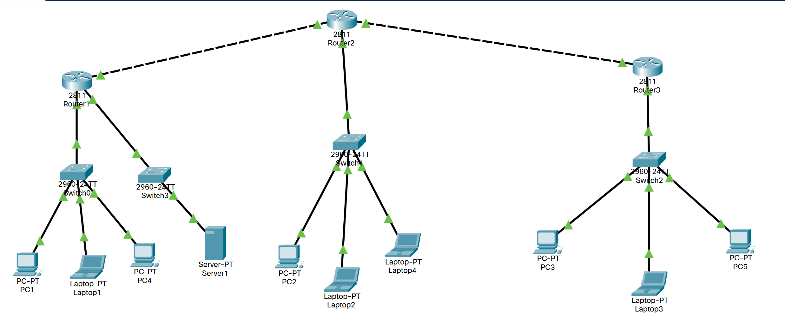

**领导人**

| 设备名称 | 使用人/部门 | 域名        |
| -------- | ----------- | ----------- |
| PC1      | 凯撒/元老院 | 192.168.1.2 |
| Laptop2  | 执政官首府  | 192.168.2.3 |
| PC3      | 部族会议所  | 192.168.3.2 |

**联络人**

| 设备名称 | 使用人/部门 | 域名        |
| -------- | ----------- | ----------- |
| Laptop1  | 元老院      | 192.168.1.4 |
| PC2      | 执政官首府  | 192.168.2.2 |
| Laptop3  | 部族会议所  | 192.168.3.3 |

**机密联络人**

| 设备名称 | 使用人/部门 | 域名        |
| -------- | ----------- | ----------- |
| Server1  | 凯撒/元老院 | 192.168.4.3 |

### 访问权限配置

访问权限配置如下

```python
#Router1
#其它机构的所有成员可以访问联络人
access-list 101 permit ip 192.168.2.0 0.0.0.255 192.168.1.4 0.0.0.0
access-list 101 permit ip 192.168.3.0 0.0.0.255 192.168.1.4 0.0.0.0
#其它机构的联络人可以访问本机构的所有成员
access-list 101 permit ip 192.168.2.2 0.0.0.0 192.168.1.0 0.0.0.255
access-list 101 permit ip 192.168.3.3 0.0.0.0 192.168.1.0 0.0.0.255
#其他机构的领导人可以访问本机构的领导人
access-list 101 permit ip 192.168.2.3 0.0.0.0 192.168.1.2 0.0.0.0
access-list 101 permit ip 192.168.3.2 0.0.0.0 192.168.1.2 0.0.0.0
#server1 可以联系 pc1
access-list 101 permit ip 192.168.4.3 0.0.0.0 192.168.1.2 0.0.0.0

#interface fa0/1
ip access-group 101 out
#pc1可以ping通server1
access-list 102 permit ip 192.168.1.2 0.0.0.0 192.168.4.3 0.0.0.0
access-list 102 permit ip 192.168.4.3 0.0.0.0 192.168.1.2 0.0.0.0
#interface fa1/0
ip access-group 102 out
```

```python
#Router2
#其它机构的所有成员可以访问联络人
access-list 103 permit ip 192.168.1.0 0.0.0.255 192.168.2.2 0.0.0.0
access-list 103 permit ip 192.168.3.0 0.0.0.255 192.168.2.2 0.0.0.0
#其它机构的联络人可以访问本机构的所有成员
access-list 103 permit ip 192.168.1.4 0.0.0.0 192.168.2.0 0.0.0.255
access-list 103 permit ip 192.168.3.3 0.0.0.0 192.168.2.0 0.0.0.255
#其他机构的领导人可以访问本机构的领导人
access-list 103 permit ip 192.168.1.2 0.0.0.0 192.168.2.3 0.0.0.0
access-list 103 permit ip 192.168.3.2 0.0.0.0 192.168.2.3 0.0.0.0
ip access-group 103 out
```

```python
#Router3
#其它机构的所有成员可以访问联络人
access-list 104 permit ip 192.168.1.0 0.0.0.255 192.168.3.3 0.0.0.0
access-list 104 permit ip 192.168.2.0 0.0.0.255 192.168.3.3 0.0.0.0
#其它机构的联络人可以访问本机构的所有成员
access-list 104 permit ip 192.168.1.4 0.0.0.0 192.168.3.0 0.0.0.255
access-list 104 permit ip 192.168.2.2 0.0.0.0 192.168.3.0 0.0.0.255
#其他机构的领导人可以访问本机构的领导人
access-list 104 permit ip 192.168.1.2 0.0.0.0 192.168.3.2 0.0.0.0
access-list 104 permit ip 192.168.2.4 0.0.0.0 192.168.3.2 0.0.0.0
ip access-group 104 out
```

### 权限控制效果展示

机构内部可以相互ping通

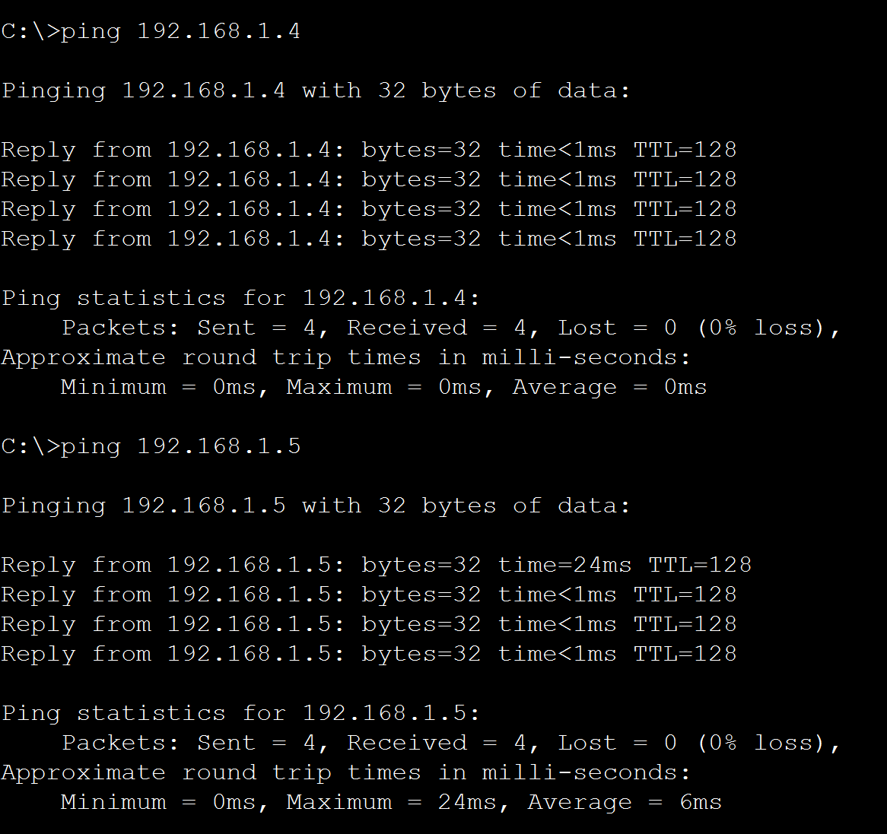

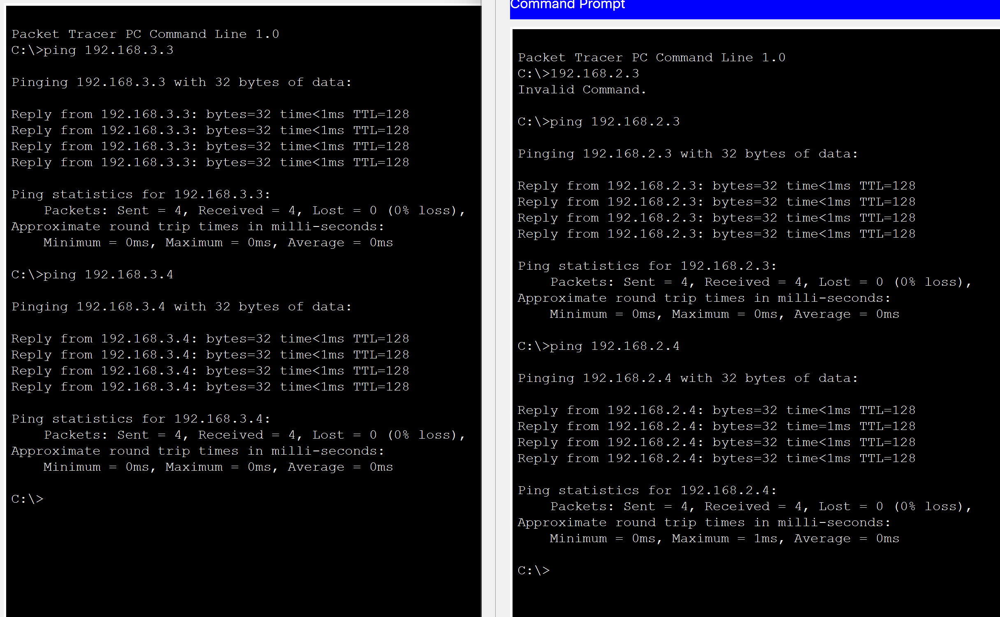

三个联络人可以和其它子网内除了server1以外的设备任意通信

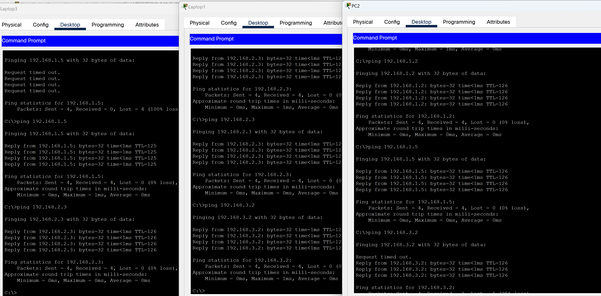

机构内的其它成员，只能和联络人通信

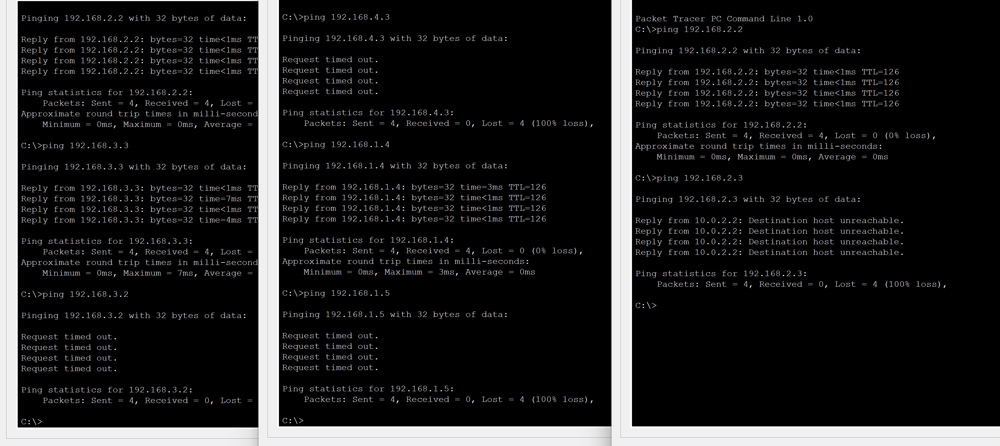

领导人之间可以相互通信

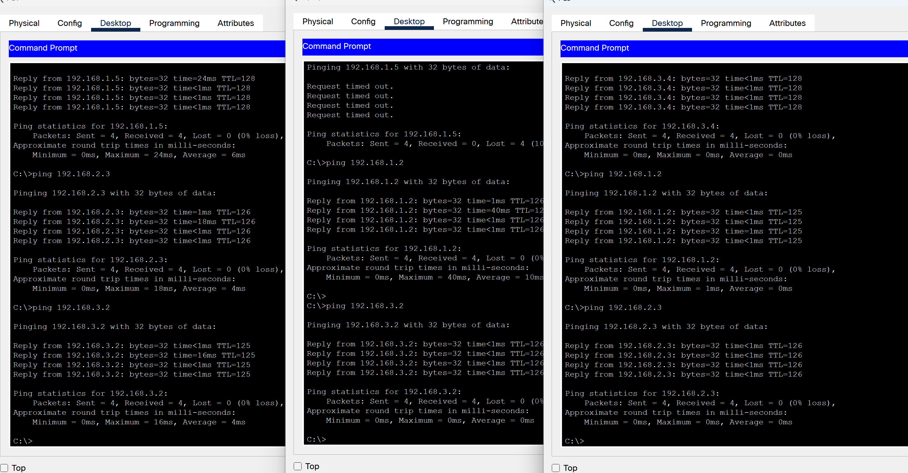

特别的，只有PC1有对Server1的访问权限

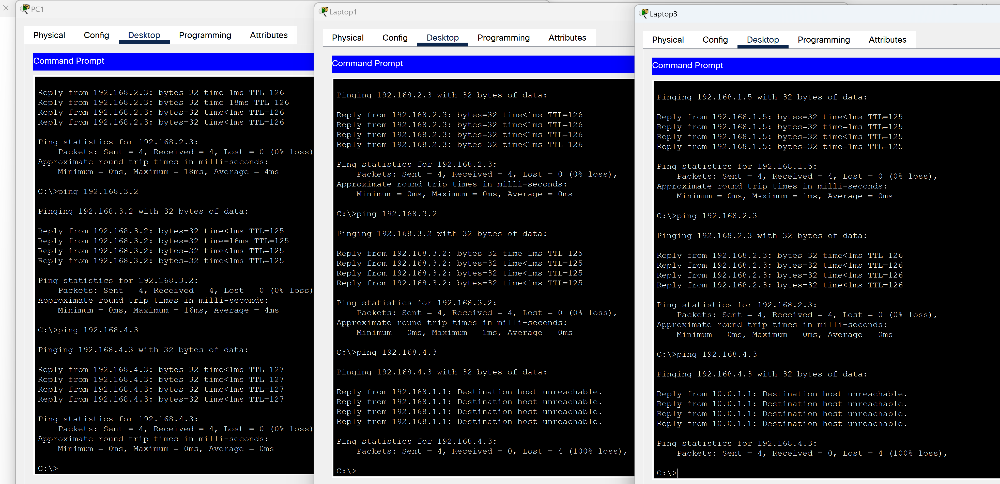

## 任务七

使用CBAC过滤cimp报文，为PC1提供特殊权限

```python
ip inspect name CBAC icmp
#interface fa1/0
ip inspect CBAC in
```

同时在Route2，Route3中添加两条权限，使得PC1可以访问机构内所有设备

```python
access-list 103 permit ip 192.168.1.2 0.0.0.0 192.168.2.0 0.0.0.255
access-list 104 permit ip 192.168.1.2 0.0.0.0 192.168.3.0 0.0.0.255
```

可以看到，设置后PC1可以访问之前子网内的普通设备了

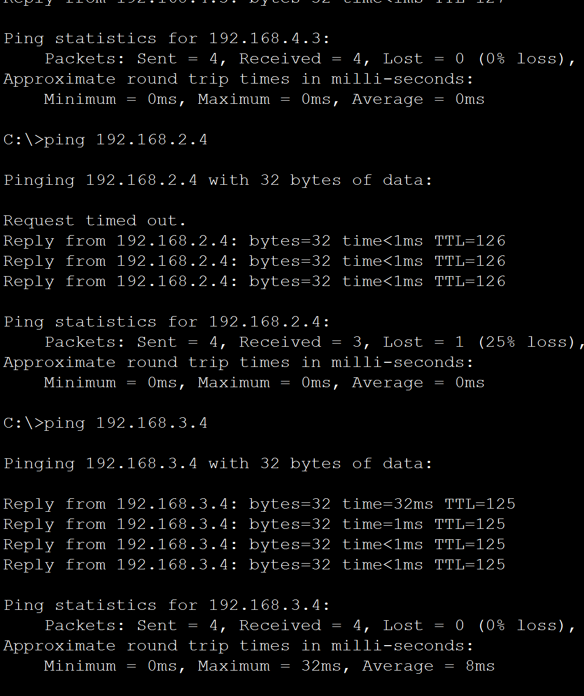

## 任务八

**在搬迁之后，使用配置静态路由的方法将无法让各个权力机构正常通信，请简述原因**

公网上一般无法做到直连路由，因此在没有进行地址转换的情况下，无法直接转发192.168.x.x/24这类的路由


配置过程：首先用 `no access-list` 去掉原有的ACL配置，然后为Router1和Router2 添加 IPSec 配置，配置如下

```python
#Router1
#Ethernet0/0
#ISAKMP配置
crypto isakmp policy 1
encryption 3des
hash md5
authentication pre-share
group 5
exit
crypto isakmp key zrp23 address 2.0.0.2
#使用ACL对流量进行过滤
access-list 101 permit ip 192.168.1.0 0.0.0.255 192.168.2.0 0.0.0.255
access-list 101 permit ip 192.168.2.0 0.0.0.255 192.168.1.0 0.0.0.255 
access-list 101 permit ip 192.168.1.0 0.0.0.255 192.168.3.0 0.0.0.255
access-list 101 permit ip 192.168.3.0 0.0.0.255 192.168.1.0 0.0.0.255
#创建transform-set
crypto ipsec transform-set zrp-vpn-set esp-3des esp-md5-hmac
#创建MAP映射表
crypto map zrp-vpn-map 1 ipsec-isakmp
set peer 2.0.0.2
set transform-set zrp-vpn-set
match address 101
exit
ip route 192.168.2.0 255.255.255.0 1.0.0.1
ip route 192.168.3.0 255.255.255.0 1.0.0.1
ip route 1.0.0.0 255.0.0.0 1.0.0.1
#Ethernet0/0 端口绑定
crypto map zrp-vpn-map

```

```python
configure terminal
#Ethernet0/0
crypto isakmp policy 1
encryption 3des
hash md5
authentication pre-share
group 5
exit
crypto isakmp key zrp23 address 1.0.0.2
access-list 102 permit ip 192.168.2.0 0.0.0.255 192.168.1.0 0.0.0.255
access-list 102 permit ip 192.168.3.0 0.0.0.255 192.168.1.0 0.0.0.255
crypto ipsec transform-set zrp-vpn-set esp-3des esp-md5-hmac
crypto map zrp-vpn-map 1 ipsec-isakmp
set peer 1.0.0.2
set transform-set zrp-vpn-set
match address 102
exit
ip route 192.168.1.0 255.255.255.0 2.0.0.1
ip route 192.168.3.0 255.255.255.0 10.0.2.1
#Ethernet0/0 端口绑定
crypto map zrp-vpn-map
```

在添加IPSec配置后，可以看到两个区域内网的机构可以正常通信，包括Route1像Route2，Route3 ping以及反过来，“共和国”内网成功穿越公网

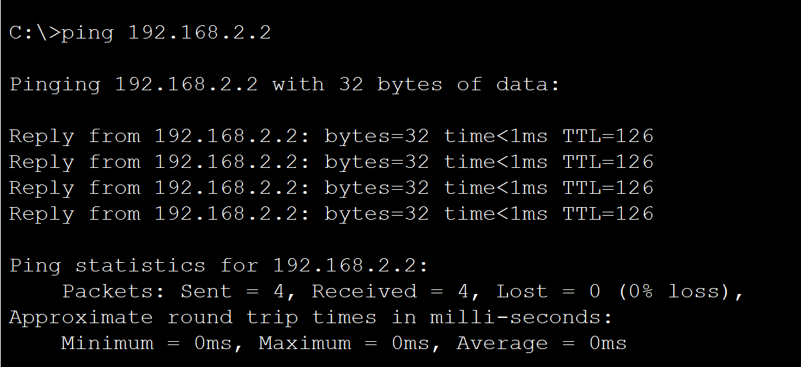

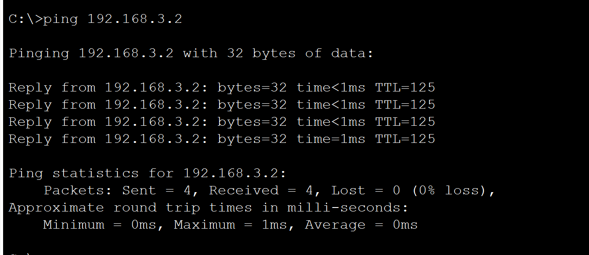

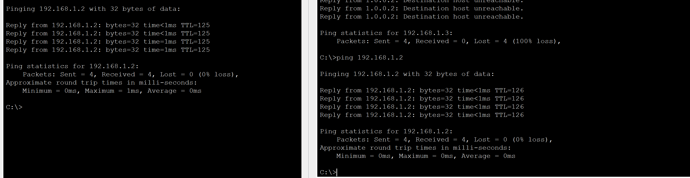

通过仿真抓包分析，可以看到在经过路由器Route1和Route2时报文的Src和Dest IP地址均被替换为了公网IP，在公网传输后再修改回内网IP，**因此可以判断，IPsec使用的是隧道模式**，因为私网和私网间通过公网通信 ，需要插入新的报文头，将原有报文头封装为负荷

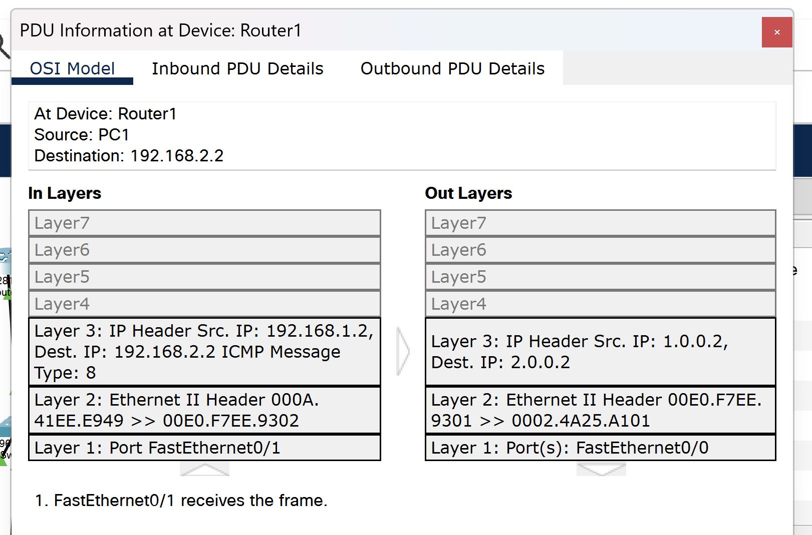

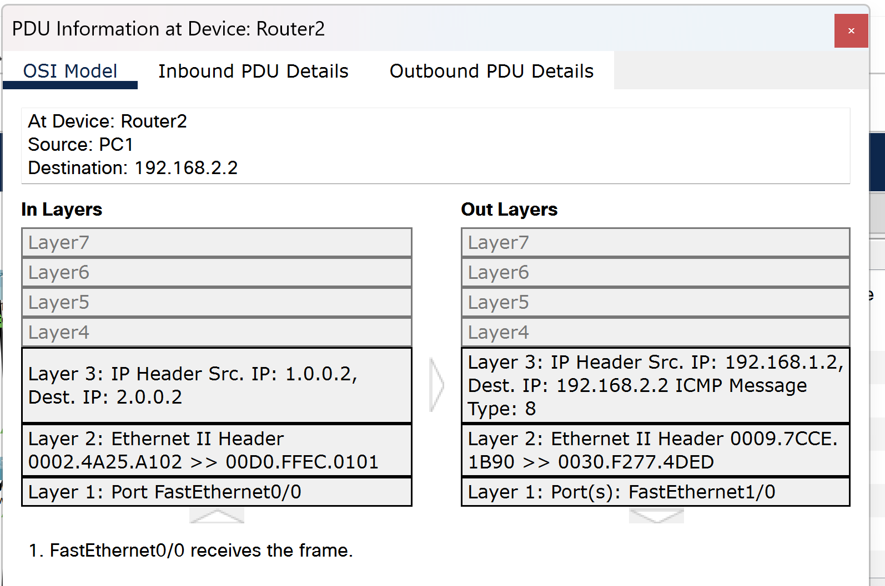


## Bonus

### 静态NAT

设定场景：部族会议所需要和外界的部族建立联系，首领听说NAT技术简单方便，想用这种技术建立私网和公网的联系，NAT地址分配如下

| 设备    | 私网地址    | 公网地址   |
| ------- | ----------- | ---------- |
| PC3     | 192.168.3.2 | 131.92.0.2 |
| Laptop3 | 192.168.3.3 | 131.92.0.3 |
| PC5     | 192.168.3.4 | 131.92.0.4 |

下图为网络拓扑结构，其中Route3及其下面的为私网，Route6及其下面的为模拟的公网，PC0和Laptop0的公网地址分别为202.31.205.2，202.31.205.3

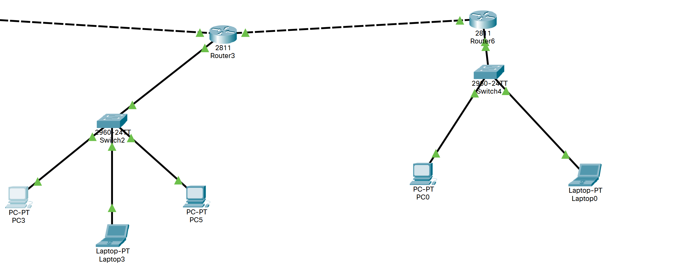

配置时只需要对Route3配置静态NAT设置，使私网和公网地址可以一一映射

```python
# Ethernet0/1
ip nat inside
# Ethernet1/0
ip nat outside
# 配置NAT映射
ip nat inside source static 192.168.3.2 131.92.0.2
ip nat inside source static 192.168.3.3 131.92.0.3
ip nat inside source static 192.168.3.4 131.92.0.4
```

配置后，公网和私网的设备可以相互ping通，不过私网是以NAT转换的地址出现在公网上

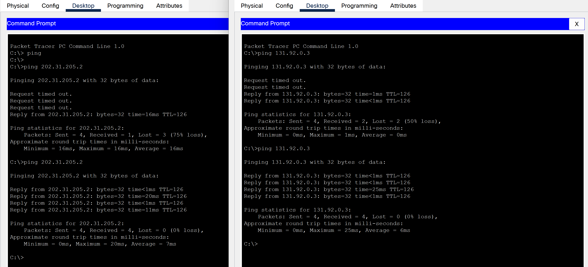

进一步通过仿真也可以观察到，经过Route3后，私网发出的报文源地址变为NAT翻译后的地址

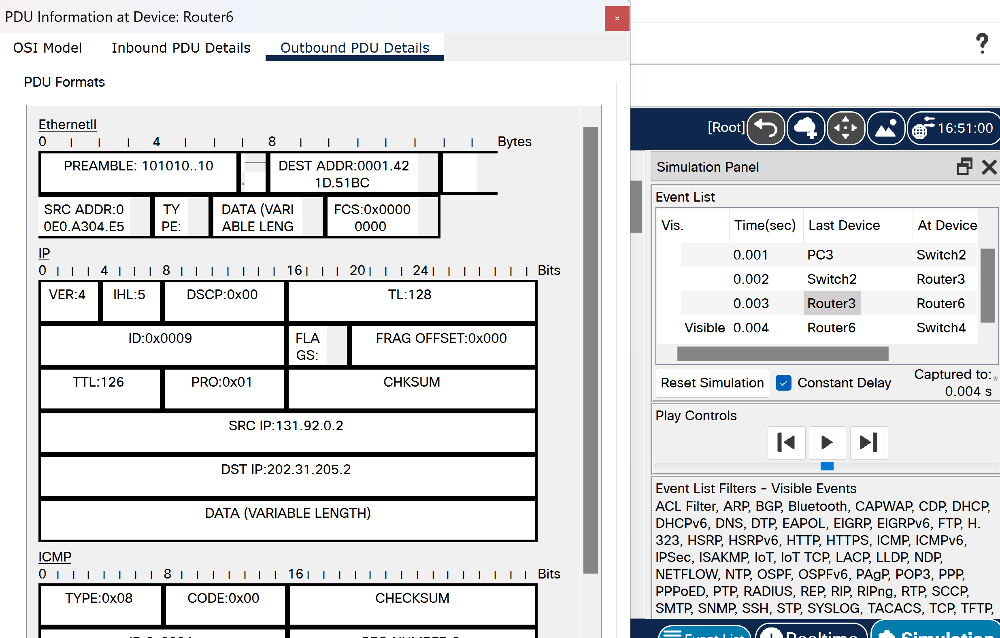

### 动态NAT

```python
# 删除之前的静态nat映射
no ip nat inside source static 192.168.3.2 131.92.0.2
no ip nat inside source static 192.168.3.3 131.92.0.3
no ip nat inside source static 192.168.3.4 131.92.0.4
# 定义访问控制列表
access-list 101 permit ip 192.168.3.0 0.0.255 any
# 定义公网地址池，命名为tribe
ip nat pool tribe 131.92.0.2 131.92.0.4 netmask 255.255.255.0
# 将列表和地址池关联
ip nat inside source list 101 pool tribe
```

配置好后，再次尝试让内网和公网通信，可以看到，PC3，Laptop3，PC5的设备仍然可以拥有一个和外界ping的虚拟地址

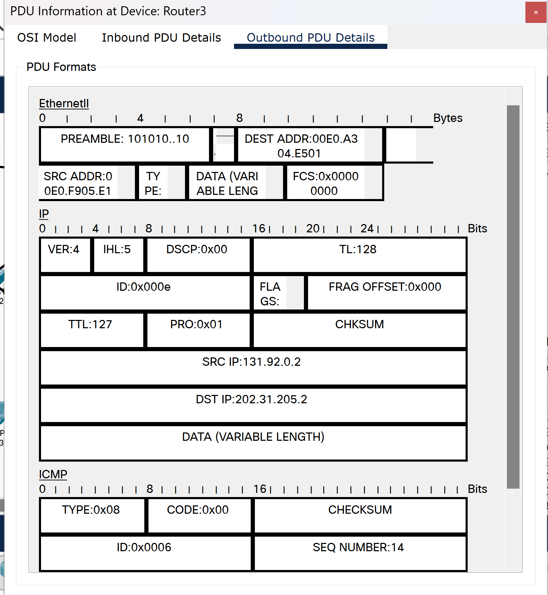

但在加入PC6(私网地址192.168.3.6)后，尝试和外部通信时，动态NAT会为其从地址池中分配一个地址 131.92.0.4

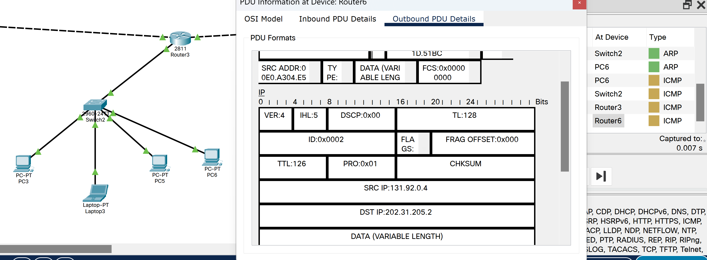

由于地址池中只有三个地址，因此当四个设备同时向公网发出ICMP包时，会因为无法分配足够多的地址而丢掉其中一个ICMP包（仿真结果中发自Laptop3的包被丢弃），等到另外三个设备完成通讯后，才可以为其分配NAT地址

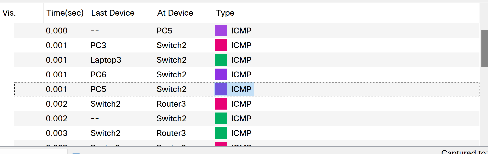

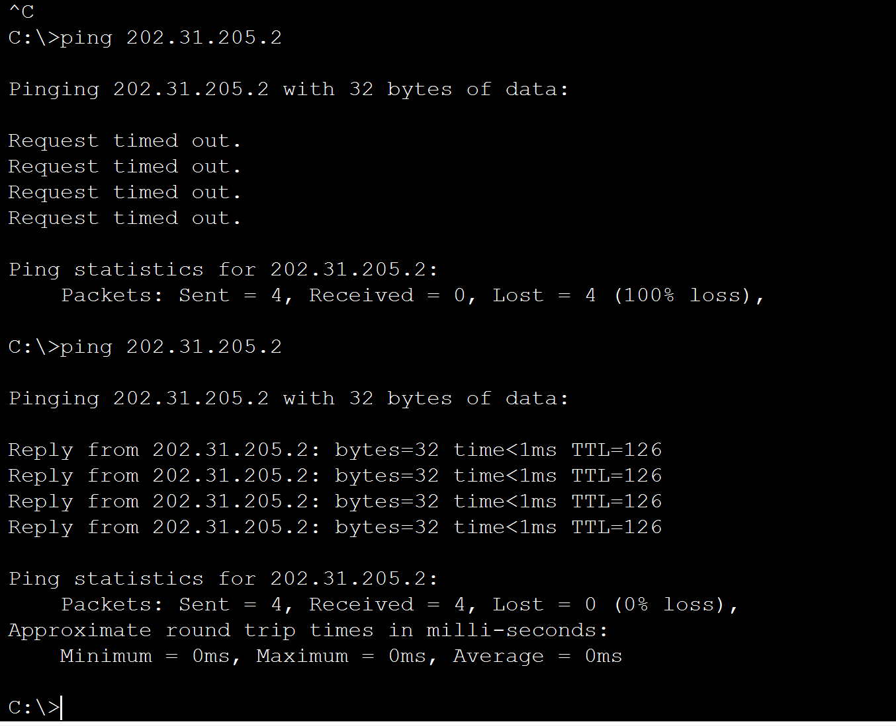

### 比较分析

**静态NAT和动态NAT对比分析**

通过以上实验可以看出，动态NAT允许多个内部私有IP地址共享少量的公共IP地址，有效节约了公共IP地址资源。同时动态NAT可以动态地分配公共IP地址，使得外部用户无法准确得知内部私有IP地址，增强了网络的安全性。而静态NAT虽然管理起来比较直观、容易维护，但不具备灵活的动态调整能力，难以应对网络拓扑结构变化，且可能造成地址资源的浪费。随着部落的扩大，内部设备数量增多，使用动态NAT势在必行！:dog:

**NAT技术和VPN技术对比**

NAT主要用于将私有IP地址转换为公共IP地址，以便内部网络与外部网络通信，同时也可以用于地址重用、端口映射等功能。VPN则主要用于加密传输数据、建立安全连接，可以实现跨地域、跨网络的安全访问。因此，NAT技术相对适用于小型局域网中（这么看来给部落使用还是十分合适的，但其它的机构就未必）而VPN则更适合在需要远程接入的大型企业或组织中，可以实现安全的远程访问和数据传输。总体来看，NAT技术在便捷性上略胜一筹，但VPN可以更好的确保网络安全